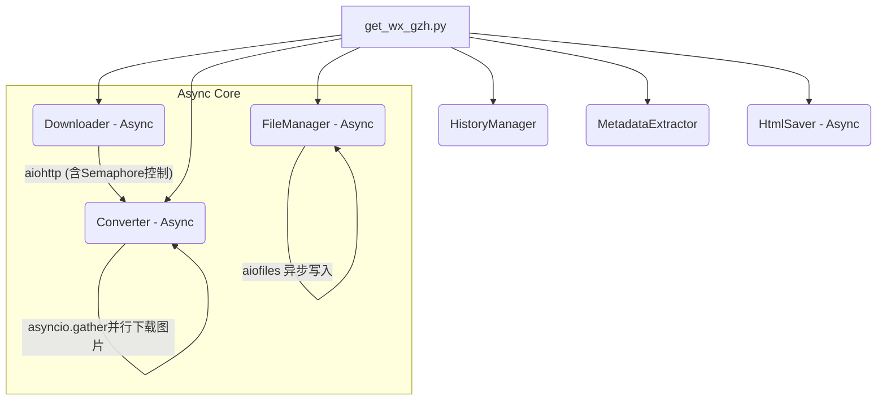

# 技术架构说明书 (Technical Architecture) v4.0

本文档描述 **WeChat Fav Downloader** 的最新架构，重点介绍 v3.x 引入的容错与自动化机制。

## 1. 架构图 (v4.5 Async)

## 2. 关键机制设计

### 2.1 异步并发与速率控制 (Async & Rate Limiting)
*   **全局信号量 (Semaphore)**: 通过 `--concurrency` 控制物理层面的最大并发文章数（默认 3），平衡抓取速度与账号安全。
*   **连接池复用**: 使用 `aiohttp.ClientSession` 管理长连接，大幅减少高频抓取时的 TCP 握手开销。
*   **并行资源下载**: 单篇文章内的所有图片采用 `asyncio.gather` 并行下载，极速缩短富媒体文章的处理时间。
*   **交错启动 (Staggered Start)**: 任务启动时加入 `0.5s - 1.5s` 的随机微延迟，模拟人类连续点击行为，增强反爬能力。
*   **非阻塞 I/O**: 文件保存和元数据写入均采用 `aiofiles`，确保高并发下主循环不会因磁盘等待而卡死。

### 2.2 外部进程隔离 (Process Isolation)
*   **PDF 生成**: 由于 `wkhtmltopdf` 是资源密集型进程，程序使用独立的 `PDF_SEMAPHORE` (限制并发为 2) 并在 `asyncio.to_thread` 中运行，防止 CPU 被瞬时压垮。

### 2.2 自动重试与错误隔离 (Fault Tolerance)
*   **分段捕获**: 程序将下载、转换、IO 分为不同阶段。
*   **延时重试**: 针对网络抖动，主循环结束后会收集 `failed_items` 列表进行第二轮尝试。
*   **持久化日志**: 记录 `error.log`，包含时间戳、URL 及具体的失败阶段，便于后期人工补救。

### 2.3 渲染逻辑与内容提取 (Rendering & Extraction)
*   **标准 HTML 优先**: v3.4 引入了自适应解析逻辑，优先尝试标准 HTML 正文提取，仅在失败时回退到特定脚本解析。这有效防止了“相册模式”文章的正文丢失。
*   **元数据增强**: 自动从 HTML 源码提取 `publish_time` 和作者信息，用于文件名及索引管理。
*   **默认 HTML 输出**: v4.0 引入，HTML 现在是默认的输出格式，提供更丰富的视觉体验。

### 2.4 内容包结构 (Storage Package)
每篇文章拥有独立容器，采用扁平化目录结构：
*   目录命名: `output/{文章标题}_{发布日期}/`
*   `[标题].html`: 新增的默认输出，包含完整样式和本地化图片。
*   `[标题].md`: 核心文本，图片链接已指向 assets (可选)。
*   `[标题].pdf`: 高保真排版文件 (可选)。
*   `assets/`: 归档所有引用的图片，文件名基于 MD5 哈希去重。

## 3. 性能优化
*   **图片去重**: 跨文章共享图片时（如果处于同一批次），通过哈希值检测避免重复下载。
*   **反爬虫保护**: 内置 `random.uniform(2, 5)` 的请求间隔，模拟真实人类访问。
*   **PDF 性能**: 利用 `wkhtmltopdf` 渲染前对微信 HTML 进行样式补丁（强制可见性、代码块高亮），修复常见空白页问题。
*   **文件名安全**: 优化文件名截断逻辑，避免因标题过长导致的文件系统错误。

## 4. 下一步开发方向
*   [x] **v4.0 (Current)**: 默认 HTML 输出、可选 Markdown/PDF、文件名智能截断、PDF 容错排版。
*   [ ] **v4.1 (TODO)**: 优化特殊文章（如图片频道）的内容提取逻辑。

