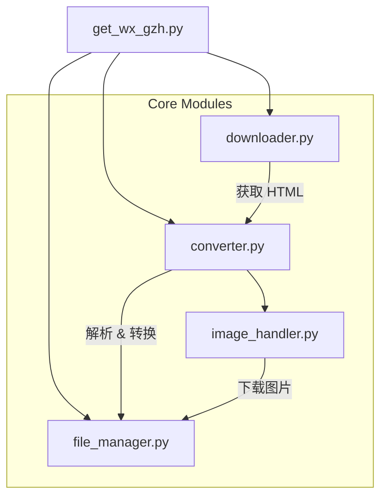

# 技术架构说明书 (Technical Architecture)

本文档旨在描述 **WeChat Fav Downloader** 的系统架构、设计决策及模块交互流程，供开发者维护和扩展参考。

## 1. 架构概览

本应用采用典型的 **ETL (Extract, Transform, Load)** 架构模式：
*   **Extract (提取)**: 从 URL 获取原始 HTML。
*   **Transform (转换)**: 清洗 HTML，提取元数据，下载资源，转换为 Markdown。
*   **Load (加载)**: 将处理后的内容和资源按特定结构写入文件系统。

## 2. 模块设计

项目采用模块化设计，核心代码位于 `core/` 目录下。

### 2.1 模块详解

#### `downloader.py` (数据获取层)
*   **职责**: 负责 HTTP 请求，处理网络异常。
*   **核心逻辑**:
    *   模拟浏览器 User-Agent 和 Headers。
    *   使用 `BeautifulSoup` 智能定位正文容器 (支持 `class="rich_media_content"`, `id="js_content"`, `id="img-content"` 多种策略)。
    *   提取标题、作者等元数据。

#### `converter.py` (转换逻辑层)
*   **职责**: HTML 到 Markdown 的转换引擎。
*   **关键特性**:
    *   **预处理**: 遍历 DOM 树，识别图片标签。
    *   **资源挂钩**: 调用 `ImageHandler` 下载图片，并实时修改 DOM 中的 `src` 属性为本地相对路径。
    *   **格式化**: 使用 `html2text` 库生成标准 Markdown，保留必要的排版。

#### `image_handler.py` (资源管理层)
*   **职责**: 图片下载与去重。
*   **设计细节**:
    *   **哈希命名**: 使用 URL 的 MD5 值作为文件名 (`md5(url).jpg`)。这天然实现了**全局去重**功能，无论多少篇文章引用了同一张图，本地只存一份（如果存在共享 assets 目录的情况下，当前设计为每篇文章独立 assets，则为单文去重）。
    *   **扩展名推断**: 结合 URL 后缀和 `Content-Type` 头智能判断文件类型。

#### `file_manager.py` (存储层)
*   **职责**: 负责文件系统的所有写操作。
*   **目录策略**: `output/{user}_{date}_Articles/{safe_title}/`。
*   **安全**: 使用正则 `sanitize_filename` 清洗文件名中的非法字符 (`\/:*?"<>|`)。

## 3. 数据流图 (Data Flow)

1.  **输入**: 读取 `urls.txt` 列表。
2.  **抓取**: `Downloader` 请求 URL -> 得到 `Raw HTML`。
3.  **解析**: `BeautifulSoup` 提取 `Content Div`。
4.  **资源化**: 
    *   遍历 `` 标签。
    *   `ImageHandler` 下载图片 -> 保存至 `assets/`。
    *   更新 `` 的 `src` 为 `assets/xxx.jpg`。
5.  **转换**: `html2text` 将处理后的 HTML -> Markdown 文本。
6.  **持久化**: `FileManager` 将 Markdown 文本写入 `.md` 文件。

## 4. 扩展性设计

### 4.1 数据库集成 (Feature #5)
目前系统通过 `urls.txt` 解耦了数据源。若要支持直接读取微信数据库：
1.  新增 `core/db_extractor.py`。
2.  实现 SQLite 解密逻辑 (需 SQLCipher)。
3.  输出格式对齐 `urls` 列表或直接生成 `Article` 对象供 `get_wx_gzh.py` 消费。

### 4.2 PDF 导出
在 `get_wx_gzh.py` 中已预留钩子。实现时建议：
*   复用 `converter.py` 处理后的 HTML (此时图片已本地化，非常适合 PDF 生成工具读取)。
*   调用 `pdfkit` 或 `WeasyPrint` 将本地 HTML 渲染为 PDF。