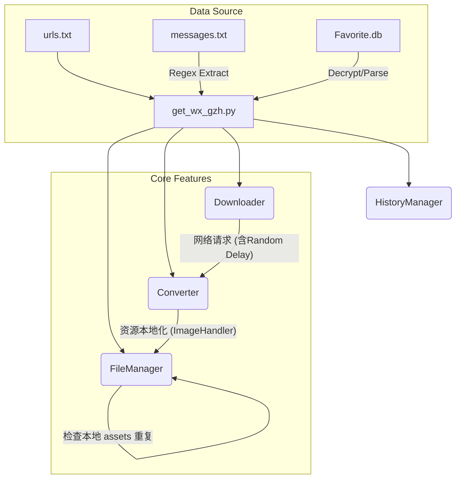

# 技术架构说明书 (Technical Architecture) v3.3

本文档描述 **WeChat Fav Downloader** 的最新架构，重点介绍 v3.x 引入的容错与自动化机制。

## 1. 架构图 (Updated)

## 2. 关键机制设计

### 2.1 断点续传 (Resumability)
*   **状态存储**: 使用 `history.log` 记录所有完全成功的处理单元（MD + PDF 均生成成功）。
*   **幂等性**: 启动时将 `history.log` 载入 `set`。在每篇文章开始前进行 `O(1)` 时间复杂度的检查。若已存在且未开启 `--force`，则秒速跳过。

### 2.2 自动重试与错误隔离 (Fault Tolerance)
*   **分段捕获**: 程序将下载、转换、IO 分为不同阶段。
*   **延时重试**: 针对网络抖动，主循环结束后会收集 `failed_items` 列表进行第二轮尝试。
*   **持久化日志**: 记录 `error.log`，包含时间戳、URL 及具体的失败阶段，便于后期人工补救。

### 2.3 内容包结构 (Storage Package)
每篇文章拥有独立容器，包含：
*   `[标题].md`: 核心文本，图片链接已指向 assets。
*   `[标题].pdf`: 高保真排版文件。
*   `assets/`: 归档所有引用的图片，文件名基于 MD5 哈希去重。

## 3. 性能优化
*   **图片去重**: 跨文章共享图片时（如果处于同一批次），通过哈希值检测避免重复下载。
*   **反爬虫保护**: 内置 `random.uniform(2, 5)` 的请求间隔，模拟真实人类访问。
*   **PDF 性能**: 利用 `wkhtmltopdf` 渲染前对微信 HTML 进行样式补丁（强制可见性、代码块高亮），修复常见空白页问题。

## 4. 下一步开发方向
*   **并发处理 (Optional)**: 如果链接数量巨大，可考虑引入 `threading`，但需配合更复杂的反爬策略。
*   **元数据解析增强**: 提取文章原始发布日期，并将其用于文件夹命名。
