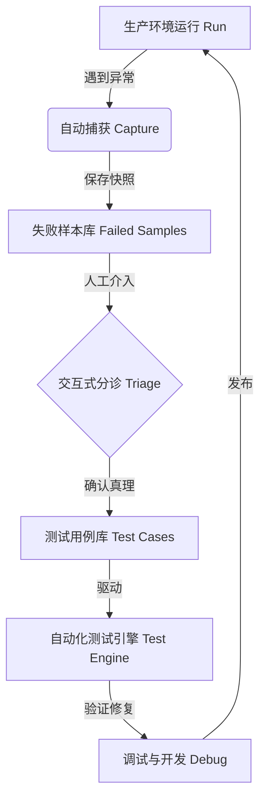

# 失败驱动开发与数据驱动测试自动化架构蓝图
# Failure-Driven Development & Data-Driven Testing Architecture

> **Version:** 1.0  
> **Date:** 2026-01-30  
> **Status:** Draft Proposal  

本文档描述了一套高效的软件质量保障体系，旨在将生产环境的错误自动转化为测试资产，通过“自动捕获”与“数据驱动”技术，实现测试用例的零代码增长。

## 1. 核心哲学 (Core Philosophy)

### 1.1 失败驱动开发 (Failure-Driven Development, FDD)
传统的测试往往是“防御性”的，开发者试图预判所有错误。FDD 承认开发者无法预判所有情况，因此建立机制：
*   **承认失败**：允许程序在未知数据面前失败。
*   **捕获现场**：失败时必须完整保留上下文（如原始 HTML/JSON）。
*   **转化资产**：每一个失败现场，一旦修复，必须成为永久的“抗体”（测试用例）。

### 1.2 闭环流程


## 2. 自动化架构设计

### 2.1 目录结构
推荐采用**数据与代码分离**的结构，测试脚本不再包含硬编码的数据。

```text
tests/
├── engine/
│   └── test_loader.py    # 通用测试引擎，负责加载 cases 并运行
├── fixtures/
│   ├── failures/         # [机器写] 自动捕获的待处理样本 (Inbox)
│   │   ├── fail_1.html
│   │   └── fail_2.html
│   └── cases/            # [人写] 已确认的测试用例 (Knowledge Base)
│       ├── comic_strip/
│       │   ├── sample.html    # 原始输入
│       │   └── sample.json    # 预期输出 (真理)
│       └── normal/
│           ├── article.html
│           └── article.json
```

### 2.2 自动捕获机制 (The Sentinel)
在核心解析逻辑中植入“哨兵”。

*   **触发条件**：
    *   抛出未捕获异常。
    *   解析结果关键字段为空（如无标题、无正文）。
    *   HTTP 200 但包含特定风控关键词。
*   **动作**：
    *   将原始响应体 (`response.text`) 写入 `tests/fixtures/failures/`。
    *   文件名包含时间戳和哈希：`fail_{timestamp}_{hash}.html`。

### 2.3 测试引擎 (The Engine)
编写一个通用的 `unittest.TestCase` 或 `pytest` 钩子：
1.  **Glob 扫描**：启动时扫描 `tests/fixtures/cases/**/*.json`。
2.  **动态生成**：为每一个 JSON 文件动态生成一个测试方法。
3.  **执行逻辑**：
    *   读取同名 `.html` 文件 -> 输入给解析器。
    *   获取解析结果 `Result`。
    *   读取 `.json` 文件 -> 作为预期结果 `Expectation`。
    *   执行深度对比：`AssertEqual(Result, Expectation)`。

## 3. 人机协作工作流 (Human-in-the-Loop)

这是连接“机器捕获”与“机器测试”的唯一人工环节。建议开发配套的 CLI 工具。

**命令**: `python manage_tests.py triage`

**交互逻辑**:
1.  **扫描**: 检查 `fixtures/failures/` 是否有新文件。
2.  **展示**: 逐个处理。自动用浏览器打开 HTML 文件。
3.  **询问**:
    > "正在处理 fail_001.html。解析器当前认为标题是 None。"
    > "请输入正确标题 (或回车跳过): "
4.  **生成**: 根据用户输入，构建标准 JSON。
5.  **归档**: 将 HTML 和新生成的 JSON 移动到 `fixtures/cases/`。

## 4. 优势总结

1.  **零代码增加测试**：修复 Bug 或新增支持时，只需添加两个文件，无需修改 Python 测试代码。
2.  **越用越强**：随着使用时间增长，`cases` 目录会成为包含所有历史边缘案例的宝贵数据库。
3.  **高保真**：测试用例直接源自生产环境的真实数据，而非人工捏造的假数据。

## 5. 实施路线图

*   **Stage 1**: 建立目录结构，手动添加前 5 个典型样本。
*   **Stage 2**: 改造单元测试，支持从 JSON 加载测试数据。
*   **Stage 3**: 在下载器中实现 `save_failed_sample` 逻辑。
*   **Stage 4**: 开发 `triage` 交互式分诊工具。
