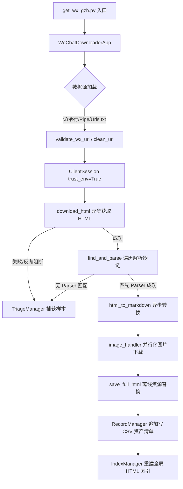

# 微信公众号文章下载器项目深度评审报告 (Project Review Report)

本报告从**功能**、**设计**、**架构**与**代码逻辑**四个维度对 `wechat_gzh_downloader` 项目进行系统性的审查与评估，旨在理清现有系统的演进链路，识别架构优势，并指出潜在的系统缺陷与优化方向。

---

## 1. 功能层次评审 (Functional Review)

### 现有功能梳理
- **多输入源读取与校验**：
  - **单 URL 命令行输入**：通过主入口接受单个 URL，支持 `--force` 参数强制刷新。
  - **默认文件导入**：读取 `input/urls.txt` 批量拉取。
  - **聊天记录提取**：通过正则 `https?://mp.weixin.qq.com/s[^\s\u4e00-\u9fa5]*` 从聊天文本导出中自动抽离微信 URL。
  - **标准输入管道 (Stdin Pipe)**：支持 Unix 管道式操作（例如 `cat urls.txt | python3 get_wx_gzh.py`），支持自动化运维脚本集成。
  - **安全过滤**：[validate_wx_url](file:///home/xmren/gemini/wechat_gzh_downloader/core/downloader.py#L8) 模块严格拦截非微信域名链接与验证码跳转地址 (`/mp/wappoc_appmsgcaptcha`)。
- **多模式运行**：
  - **批量处理模式**：高并发异步请求所有未抓取的 URL。
  - **交互式控制台模式**：允许用户逐条输入 URL 进行实时下载和调试。
- **多格式本地归档**：
  - **完整 HTML 归档**：在本地注入排版 CSS，并下载图片离线化，修正懒加载属性。
  - **Markdown 转换**：通过 `html2text` 清除微信冗余广告/导航，保存干净的文章骨架。
  - **PDF 离线文件**：依赖 `wkhtmltopdf` 渲染包含本地化图片的 HTML 为 PDF。
- **全局资产清单与索引**：
  - 用 `wechat_records.csv` 承载所有已下载文章状态与源元数据。
  - 自动生成或离线重建可视化入口 [index.html](file:///home/xmren/gemini/wechat_gzh_downloader/output/index.html)。

### 评估与建议
1. **wkhtmltopdf 的外部强依赖性**：PDF 生成强依赖系统内安装 `wkhtmltopdf`。这在容器化或极简云部署环境中可能会导致初始化失败。
   *建议*：在 PDF 引擎层增加对其他工具（如 PyMuPDF 或 Playwright 打印 PDF）的适配性封装，或在缺少依赖时提供明确的弱降级提示。
2. **断点续传的增量过滤机制**：去重仅根据内存中由 CSV 加载的 `processed_urls` 过滤。这虽然极大提升了效率，但若用户中途删除本地文章目录，CSV 清单将与本地文件系统失真。
   *建议*：[RecordManager](file:///home/xmren/gemini/wechat_gzh_downloader/core/record_manager.py) 的 `rebuild_from_folder` 已经提供了极好的磁盘扫描重建能力，可考虑作为启动参数（如 `--sync-disk`）提供自动同步，避免用户不得不手动重跑脚本重建清单。

---

## 2. 设计层次评审 (Design Review)

### 核心设计模式

#### ① 故障分诊设计 (Triage Manager)
- **实现方案**：[TriageManager](file:///home/xmren/gemini/wechat_gzh_downloader/core/triage/manager.py) 对下载或解析出错的 URL 建立故障现场捕获机制。将 HTML 源文件和错误异常元数据输出到 `triage_samples/` 目录中。
- **设计优势**：
  - **防御性测试数据源**：将生产环境的异常网页直接保存，避免了在微信频繁调整页面标签时，开发者面临“无现场、盲猜式调试”的问题。
  - **去重防爆**：利用对 `URL + Reason` 生成短 MD5 的机制，防止同一页面同一原因被无限重复采集。

#### ② 反爬虫与反风控防护 (Anti-bot Design)
- **实现方案**：
  - 引入了 `settings.py` 中的随机时间间隔 (3s~6s)；
  - 出现解析错误等软性故障时，使用**线性退避机制**（Linear Backoff，退避公式为 `attempt * 2` 秒）；
  - 主动识别微信的 `verify.html` 或 `weui-msg` 阻断信号，将封锁现场传回 Triage 系统，防止静默失败。

#### ③ 模块化多解析器设计 (Parser Registry Pattern)
- **实现方案**：设计了 [BaseParser](file:///home/xmren/gemini/wechat_gzh_downloader/core/parsers/base.py) 基类、修饰器式注册机制 [registry.py](file:///home/xmren/gemini/wechat_gzh_downloader/core/parsers/registry.py) 以及 `find_and_parse` 统一入口。
- **设计优势**：
  - 符合**开闭原则 (OCP)**：当微信发布新的页面排版（如 2026 新出现的图片/文本混合布局、纯文字动态分享等）时，只需新建如 [ShareTextParser](file:///home/xmren/gemini/wechat_gzh_downloader/core/parsers/share_text.py) 解析器并注册，无需改动任何下游转换和下载核心逻辑。
  - **优先级机制**：[__init__.py](file:///home/xmren/gemini/wechat_gzh_downloader/core/parsers/__init__.py) 的导入顺序天然决定了解析器的匹配链，从特化解析器逐步降级到通用 [StandardParser](file:///home/xmren/gemini/wechat_gzh_downloader/core/parsers/standard.py)。

---

## 3. 架构层次评审 (Architectural Review)

### 整体数据流向 (Data Flow)

系统的运作逻辑呈现典型的“管道-过滤器”架构。网络拉取与文档转换高度异步化，持久化层使用 CSV 与 JSON 双重清单。



### 架构优势与不足
- **优势**：
  - **低内聚、高内聚**：抓取 (Downloader) 与页面提取 (Parsers)、文档格式流转换 (Converter) 严格分层。
  - **异步核心驱动**：请求与静态文件下载均由 `aiohttp` 协程完成，极大地利用了单线程 I/O 复用能力，在大量 URL 处理时吞吐率高。
- **不足**：
  - **持久化层的并发安全性限制**：资产记录通过追加写入单个 CSV 文件实现。尽管 `RecordManager.add_record` 是协程，但由于没有互斥锁（Mutex），在高并发度写入时，多协程并行调用 `aiofiles.open(..., 'a')` 往同一个文件追加写入在极端情况下有可能产生行错位甚至部分覆盖的风险。

---

## 4. 代码逻辑层次评审 (Code-Level Review)

### 优秀代码实践 (Highlights)

- **防御性文本清洗与 Hex 解码**：
  [BaseParser.decode_wechat_text](file:///home/xmren/gemini/wechat_gzh_downloader/core/parsers/base.py#L26) 利用正则回调函数：
  ```python
  def _hex_decode(match):
      try:
          return chr(int(match.group(1), 16))
      except Exception:
          return match.group(0)
  ```
  该设计比传统的直接 `decode('unicode_escape')` 更加安全，因为微信正文中常会出现非 ASCII 字符或中文乱码冲突，这种逐个替换的机制既清理了 `\x26` 等字符，又绝对保证了中文字符的完整。
  
- **混合通道中巧妙的闭括号匹配算法**：
  在 [ImageDetailParser](file:///home/xmren/gemini/wechat_gzh_downloader/core/parsers/image_detail.py#L40) 中，针对页面内嵌的大段混淆 JS 变量 `picture_page_info_list`，使用了括号平衡算法截取完整的 JSON 数组字符串，避免了正则提取在遇到复杂转义符时的失效。

- **IO 密集型任务的并发编排**：
  在图片处理模块 [converter.py](file:///home/xmren/gemini/wechat_gzh_downloader/core/converter.py#L58) 中，利用 `asyncio.gather(*img_tasks)` 并行并发地拉取一篇文章包含的数十张图片，并将下载结果与图片 DOM 节点重新映射，这极大地改善了网络爬取的阻塞痛点。

### 代码逻辑风险与缺陷

#### ① CSV 记录并发写入风险
在 [RecordManager](file:///home/xmren/gemini/wechat_gzh_downloader/core/record_manager.py#L73) 中，虽然通过写 String 缓冲区来规避了行分片，但高并发状态下写入同一文件依旧可能因文件锁缺乏产生写入冲突：
```python
async with aiofiles.open(self.csv_path, 'a', encoding='utf-8-sig') as f:
    await f.write(csv_line)
```
*改进方案*：在 `RecordManager` 的初始化中定义一个 `asyncio.Lock()`，并在写入操作时使用 `async with self.lock:` 保护。

#### ② 异常捕获中 `locals()` 的作用域盲区
在 [app.py](file:///home/xmren/gemini/wechat_gzh_downloader/core/app.py#L236) 中：
```python
current_html = locals().get('html_content')
```
如果在网络下载直接抛出异常，`html_content` 变量在 `try` 块的本地作用域中实际上尚未被成功赋值（并不存在于当前作用域 of `locals()` 中）。这会触发 triage 捕获时 `current_html` 依旧为空，导致现场漏失。
*改进方案*：应在 `try` 块运行之前在最外层显式声明 `html_content = None`。

#### ③ BeautifulSoup 重复解析开销
在 [app.py](file:///home/xmren/gemini/wechat_gzh_downloader/core/app.py#L159) 处理流程中：
1. `find_and_parse` 内部执行了一次或多次 `BeautifulSoup(html, "lxml")` 用于解析元数据和常规正文。
2. 随后的 `html_to_markdown` 内部又在 `process_wechat_html` 中执行了一次 `BeautifulSoup(html_content, "lxml")` 对文章图片及冗余 DOM 进行清洗。
*分析*：对于长图文来说，多次对大体量 HTML 载入 `BeautifulSoup` 占用了相当的 CPU 算力。
*改进方案*：考虑将解析器架构调整为允许传递已解析的 `BeautifulSoup` 树状结构，或由 `find_and_parse` 直接返回部分清洗后的树，减少重复构建 DOM 树的开销。

---

## 5. 总结与改进清单 (Actionable Summary)

| 改进方向 | 归属组件 | 严重度 | 描述 |
| :--- | :--- | :---: | :--- |
| **引入写入排他锁** | `RecordManager` | 中 (Medium) | 在高并发写入 CSV 清单时，使用 `asyncio.Lock` 规避协程争抢写入通道。 |
| **修补作用域漏洞** | `WeChatDownloaderApp` | 低 (Low) | 在主流程 `try` 块外部初始化 `html_content = None`，保证异常触发时能够成功将残留 HTML 送入 Triage 故障记录。 |
| **wkhtmltopdf 依赖弱化** | `PDFGenerator` | 低 (Low) | 增加兜底提示或采用更轻量的 Python 原生 PDF 包作为替代降级选择。 |
| **DOM 解析开销优化** | `Parsers` & `Converter` | 低 (Low) | 优化 DOM 解析次数，减少 BeautifulSoup 对象在单次文章流转中的重复创建。 |
