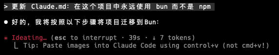
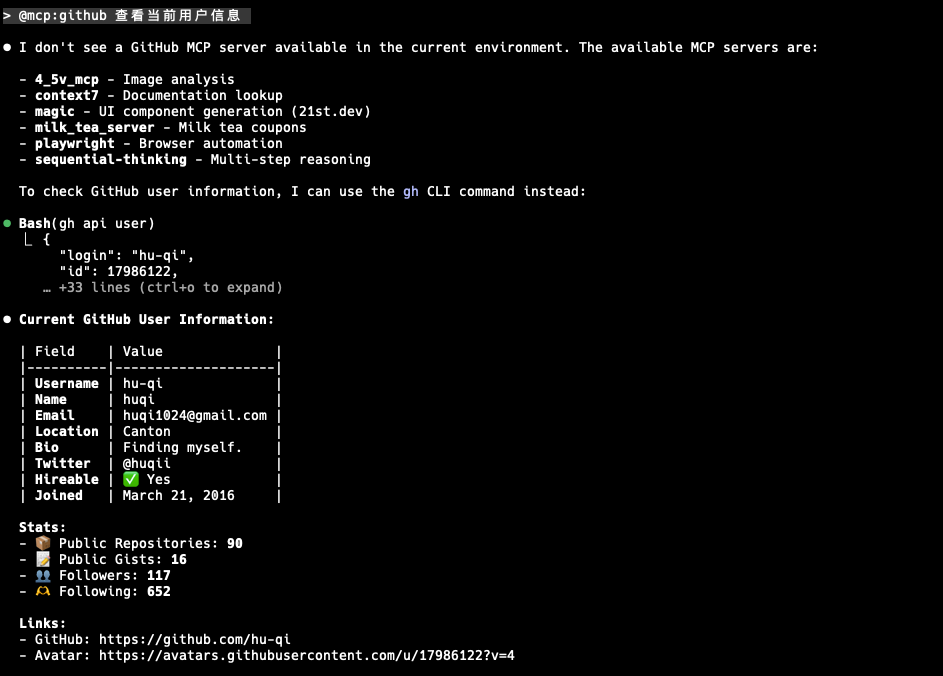
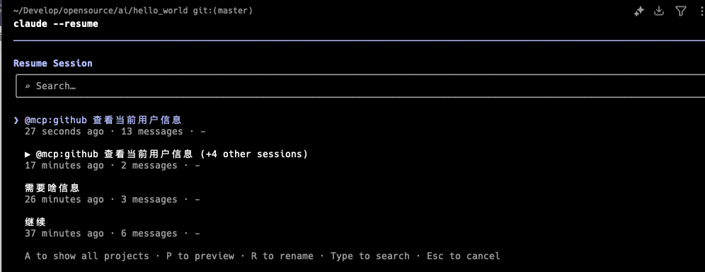
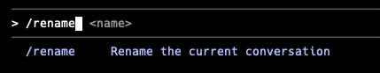
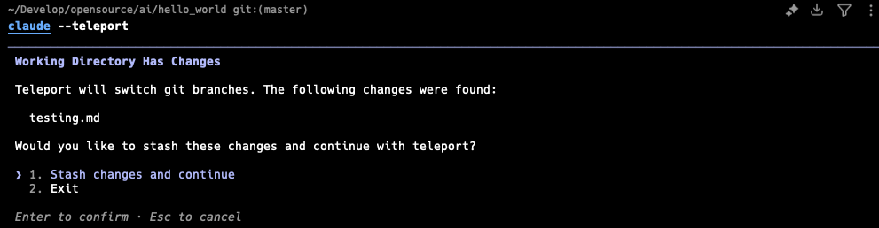
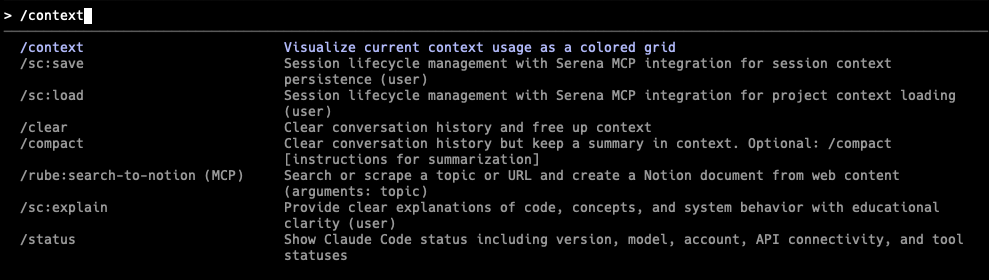
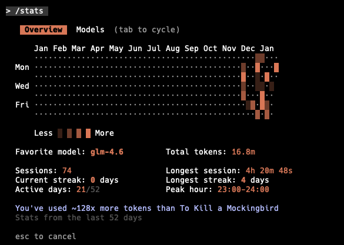

# 31 个让你的 Claude Code 效率起飞的隐藏技巧

> 原文链接: https://mp.weixin.qq.com/s?__biz=MzI2NjMwODY4MQ==&mid=2247487672&idx=1&sn=69518e61820f8a5bd73d11ec7b8c3070&chksm=eb8de6844b7d56414c6229f06d27988edc868c1b65895c3d10cce5952b320fcbd890d0194034&mpshare=1&scene=24&srcid=01187gleGyalV2mxHyVdJecl&sharer_shareinfo=69873102cfcd959ea0edb741c22801f4&sharer_shareinfo_first=69873102cfcd959ea0edb741c22801f4#rd
> 图片状态: 已本地化 (assets/)

---

# 31 个让你的 Claude Code 效率起飞的隐藏技巧

> 译自：Advent of Claude: 31 Days of Claude Code

Claude Code 不仅仅是一个 AI 编程助手，更是一个功能强大的终端开发环境。这里有 31 个能彻底改变你编码工作流的实用技巧。

* * *

## 起步：让 Claude 读懂你的项目

**1.` /init` \- 自动生成项目说明书**在任何新项目中，首先运行 `/init`。Claude 会扫描你的代码库，自动生成一个 `CLAUDE.md` 文件，包含构建命令、架构模式和代码规范。这是 Claude 的“长期记忆”。

/init

**2.`.claude/rules/` \- 模块化规则**项目太大？除了 `CLAUDE.md`，你还可以在 `.claude/rules/` 目录下创建特定主题的规则文件（如 `testing.md`, `security.md`）。Claude 会根据上下文自动加载这些规则。

.claude/rules/

**3\. 自然语言更新记忆** 不需要手动编辑 `CLAUDE.md`。直接告诉 Claude：“更新 Claude.md：在这个项目中永远使用 bun 而不是 npm”。它会自动帮你修改记忆文件。

更新 Claude.md

**4.` @` Mentions - 极速引用上下文**就像在 Slack 里一样，使用 `@` 快速把文件、目录或 MCP 工具拉入上下文：

  * `@src/auth.ts`（引用文件）
  * `@src/components/`（引用整个目录）
  * `@mcp:github`（调用 GitHub 工具）

@mcp:github

* * *

## 快捷键：指尖的魔法

**5.`!` 前缀 - 瞬间执行 Bash**别问 Claude “能不能运行 git status”。直接输入 `! git status`。`!` 前缀会让命令立即在 Shell 中执行，无需模型思考，既省 Token 又省时间。

！前缀

**6\. 双击` Esc` \- 时光倒流**尝试了一个新思路但搞砸了？双击 `Esc` 键，瞬间回退到上一个干净的检查点（Checkpoint）。代码和对话都会恢复。

双击 `Esc`

**7.` Ctrl + R` \- 历史记录搜索**别再重复打字了。按 `Ctrl + R` 可以搜索你过去输入过的 Prompt，再次按下可循环选择，按 `Tab` 编辑，按 `Enter` 执行。

`Ctrl + R`

**8.` Ctrl + S` \- Prompt 暂存 (Stash)**写 Prompt 写到一半需要查资料？按 `Ctrl + S` 暂存当前草稿。处理完别的事情后，草稿会自动恢复。

`Ctrl + S`

**9\. 智能工作流补全** Claude 能预测你的下一步。当你完成一个任务后，如果看到灰色的建议文字，按 `Tab` 接受并编辑，或按 `Enter` 直接运行。

* * *

## 会话管理：随时随地无缝衔接

**10\. 断点续传** 终端意外关闭？电脑没电？

  * `claude --continue`：立即恢复上一次的对话。
  * `claude --resume`：从历史会话列表中选择并恢复。

会话管理

**11\. 给会话起个名** 像给 Git 分支命名一样管理你的会话：

  * `/rename api-migration`：重命名当前会话。
  * `/resume api-migration`：按名称恢复。

给会话起个名

**12\. 远程传送 (Teleport)** 在网页版 `claude.ai/code` 上开始任务，然后通过 `claude --teleport session_id` 将其“传送”到你的本地终端继续完成。

Teleport

**13.` /export` \- 留存证据**需要复盘或分享？运行 `/export` 将整个对话（包括 Prompt、回复、工具调用）导出为 Markdown 文件。

/export

* * *

## 生产力：不仅是快，是掌控

**14\. Vim 模式** 不想把手移开键盘？输入 `/vim` 开启 Vim 编辑模式，用 `hjkl` 导航，用 `dd` 删除，用 `ciw` 修改单词。再次输入 `/vim` 即可退出。

/vim

**15.` /statusline` \- 自定义状态栏**底部状态栏显示什么由你定：Git 分支、当前模型、Token 使用量、上下文窗口占比等。信息一目了然。

/statusline

**16.` /context` \- Token 透视眼**担心 Context 爆了？输入 `/context` 查看究竟是谁吃掉了 Token（系统提示词、MCP 工具、记忆文件还是历史记录）。

/context

**17.` /stats` \- 你的仪表盘**输入 `/stats` 查看你的使用习惯、最爱用的模型、连续使用天数等数据。

/stats

**18.` /usage` \- 额度监控**输入 `/usage` 查看当前 API 使用量和剩余额度，避免突然被限流。

/usage

* * *

## 思考与规划：更聪明的 AI

**19.` > ultrathink` \- 深度思考模式**遇到难题？在 Prompt 中加入 `ultrathink` 关键字（如 `> ultrathink: 设计一个高并发缓存层`），Claude 会在回答前分配更多 Token 进行深度推理。

ultrathink

**20\. Plan Mode (规划模式)** 双击 `Shift + Tab` 进入规划模式。Claude 会先阅读代码、分析架构并起草计划，但在你批准之前**绝不修改任何代码** 。先谋后动。

Plan Mode

**21\. Extended Thinking (API)** 如果你直接使用 API，开启 Extended Thinking 可以看到 Claude 详细的思维链（Thinking Blocks），非常适合调试复杂逻辑。

* * *

## 权限与安全：将 AI 关进笼子

**22.` /sandbox` \- 沙盒模式**厌倦了一次次点“Approve”？用 `/sandbox` 预先定义权限范围（如允许 `npm test`，允许读取 `src/`）。在此范围内，Claude 可以自动执行。

**23\. YOLO 模式**` claude --dangerously-skip-permissions`这个标志（Flag）会跳过所有权限检查。名字里的“Dangerously”不是开玩笑的——仅在沙盒环境或你完全信任的操作中使用。

**24\. Hooks (生命周期钩子)** 在 `.claude/settings.json` 中配置 Hooks，可以在工具执行前后、权限请求时自动运行 Shell 脚本。比如在 Claude 修改代码前自动运行 Linter。

* * *

## 自动化与高级玩法

**25\. Headless Mode (无头模式)** 将 Claude 集成到脚本中：`git diff | claude -p "解释这些更改"``-p` 参数让 Claude 非交互式运行，并将结果直接输出到标准输出。

**26\. 自定义 Commands** 把你常用的 Prompt 保存为 Markdown 文件，变成可复用的 Slash 命令（如 `/daily-standup`）。还可以接受参数！

**27\. Chrome 浏览器集成** Claude Code 现在可以控制 Chrome 了。安装扩展后，你可以让它“打开这个页面，点击注册，并验证登录流程”。

**28\. Subagents (子 Agent)** 像是圣诞老人的小精灵。主 Agent 可以生成拥有独立 200k 上下文的子 Agent，并行处理特定任务，然后将结果汇总。

**29\. Agent Skills (技能包)** 将一组指令、脚本和工具打包成“技能”。无论是在哪个项目，都可以随时加载这些特定领域的专长。

**30\. Plugins (插件)** 一键安装工作流：`/plugin install my-setup`。插件可以包含命令、Agent、技能、Hooks 和 MCP 服务器。

**31\. LSP 集成 (IDE 级感知)** Claude Code 现在支持 LSP (Language Server Protocol)。这意味着它能像 VS Code 一样“看懂”你的代码——跳转定义、查看类型、发现错误，而不仅仅是把代码当文本处理。

* * *

### 尾声

Claude Code 的强大之处不在于它能自动完成所有事，而在于它给了你**控制权** 。从 `Plan Mode` 到 `Hooks`，这些工具是为那些懂得如何与 AI 协作的开发者准备的。

我相信这些技巧中的大部分，同样也使用于 OpenCode。

**2026，让我们学会更好地使用AI 工具！**

  

