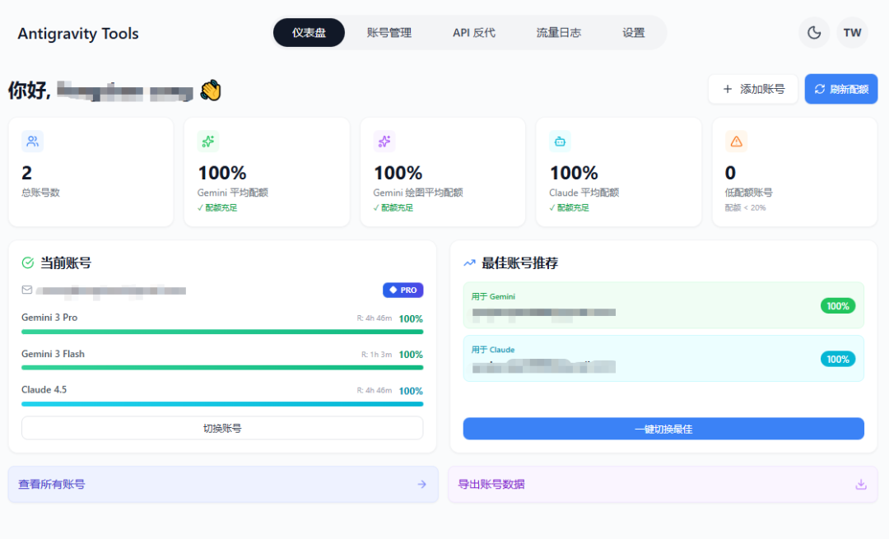

# Gemini3 Pro 配额暴涨 5 倍！家庭组 + 这个工具，自动切换不中断

> 原文链接: https://mp.weixin.qq.com/s?__biz=MzIwMTMzMTkwOQ==&mid=2247484050&idx=1&sn=f5b952652e338d8e982e3424b076c912&chksm=9797b2a6898624a0a7c51081beecb67cb73b5c38fc2e102e1db40d1d1d95c83d83c61931787a&mpshare=1&scene=24&srcid=0119PxdURUnT4FouxsKxmGPY&sharer_shareinfo=0ff4d5d572c0cce612cd3d313c23dc8e&sharer_shareinfo_first=0ff4d5d572c0cce612cd3d313c23dc8e#rd
> 图片状态: 已本地化 (assets/)

---

经常用 Google Gemini3 Pro 的朋友肯定有过这种困扰：Antigravity高强度使用半天就提示配额耗尽，想继续用只能等配额重置，连续高强度配额耗尽还会被额外限额，5h刷新额度变成几天刷新一次额度。

谷歌家庭组的方案可以一定程度上解决这个问题，具体内容参考我之前的文章[1人白嫖，等于5人白嫖？Google Gemini 3 Pro 大福利：手把手教你如何开启家庭组“无限白嫖”模式](<https://mp.weixin.qq.com/s?__biz=MzIwMTMzMTkwOQ==&mid=2247483951&idx=1&sn=3c3f6ed65270c00cfc53f768b4db25ec&scene=21#wechat_redirect>)

只需要一个主账号开了Gemini3 Pro的学生优惠会员，再建5个小号拉入家庭组，就同时拥有了6个可以分别享受额度的账户了，但是手动切换起来又麻烦又怕被风控。

直到我发现了 Antigravity Tools+Google 家庭组的神仙组合，直接把 1 个账号的可用配额提升 5 倍！不用手动切换账号，不用额外付费，系统自动轮替，彻底实现 AI 使用自由。

## 实操指南：5 分钟配置完成

##   

### 第一步：创建 Google 家庭组并添加子账号

###   

  1. 打开 Google 账户页面（myaccount.google.com），找到 “家庭组” 选项，创建新家庭组；

  2. 点击 “添加成员”，输入5个注册了google账号的邮箱地址（可注册临时邮箱，无需实名）；

  3. 邀请通过后，在 Gemini 设置中开启 “家庭共享”，确保子账号都能使用 Pro 权益。

  

### 第二步：下载安装 Antigravity Tools

支持 Windows、macOS、Linux 全平台，安装超简单：

  * 手动下载：访问 GitHub Releases 页面（https://github.com/lbjlaq/Antigravity-Manager/releases），下载对应系统安装包；

  

  * macOS 命令行安装（推荐）：

  *   *   *   * 

    
    
    # 订阅仓库brew tap lbjlaq/antigravity-manager https://github.com/lbjlaq/Antigravity-Manager# 安装应用（权限问题加--no-quarantine）brew install --cask --no-quarantine antigravity-tools

### 第三步：批量导入账号并配置自动切换

  1. 打开工具，进入 “账号管理” 页面，点击 “添加账号” 选择 OAuth 授权；

  2. 复制生成的授权链接，用每个子账号依次在浏览器完成授权，工具会自动保存账号信息；

  

  3. 全部账号添加完成后，进入 “API 反代” 页面，启动服务，默认地址为http://127.0.0.1:8045；

  

  4. 进入 “设置” 页面，开启 “全局上游代理” ，让所有流量都走VPN，无需其他复杂配置。

###   

### 第四步：对接 AI 工具使用

  * Claude Code 配置：在终端执行以下命令，直接调用叠加后的配额：

  *   *   * 

    
    
    export ANTHROPIC_API_KEY="sk-antigravity"export ANTHROPIC_BASE_URL="http://127.0.0.1:8045"claude

Python 代码调用：

  *   *   *   *   *   *   *   *   *   * 

    
    
    import openaiclient = openai.OpenAI(    api_key="sk-antigravity",    base_url="http://127.0.0.1:8045/v1")# 自动使用配额充足的账号response = client.chat.completions.create(    model="gemini-3-pro-high",    messages=[{"role": "user", "content": "帮我优化这段代码"}])

## 关键技巧：让配额利用效率翻倍

  1. 开启 “配额保护”：在设置中勾选需要保护的模型，避免某个账号被过度消耗；
  2. 利用 “最佳账号推荐”：工具会根据配额冗余度实时推荐最优账号，一键切换；
  3. 定期刷新配额：在仪表盘点击 “刷新配额”，实时同步所有账号的剩余额度；
  4. 启用日志监控：通过 “流量日志” 查看每个账号的消耗情况，精准调整使用策略。  

## 为什么必须选这个组合？

  * 成本为 0：家庭组共享完全免费，工具开源无付费功能；
  * 稳定性拉满：工具支持毫秒级账号切换，不会出现请求中断；
  * 安全无风险：所有账号数据加密存储在本地，不会泄露给第三方；
  * 兼容性极强：支持 OpenAI、Claude、Gemini 等多协议，几乎所有 AI 工具都能对接。  

## 最后说两句

Antigravity Tools+Google 家庭组的组合，堪称 Gemini Pro 用户的 “配额扩容神器”。不用额外付费，不用手动切换账号，就能轻松获得 5 倍配额，无论是高强度创作、开发辅助还是日常办公，都能彻底告别配额焦虑。

目前工具已更新到 v3.3.38 版本，对家庭组账号的管理更稳定，还支持账号批量导入、失效自动标注等功能。不过要注意，经过评论区提醒，该方案有被风控的风险，注意谨慎尝试，常用主账号建议不要使用。

项目地址：

> https://github.com/lbjlaq/Antigravity-Manager

如果我分享的内容对你有用，请关注我，为你分享更多有用的AI工具与知识。

点亮星标，才能每次收到及时消息推送哦！
