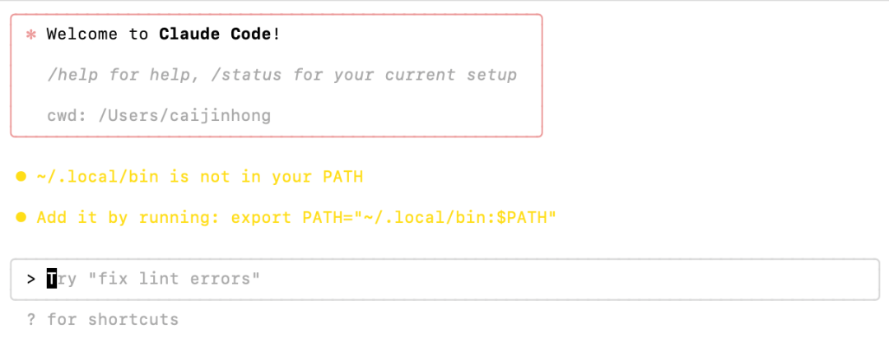
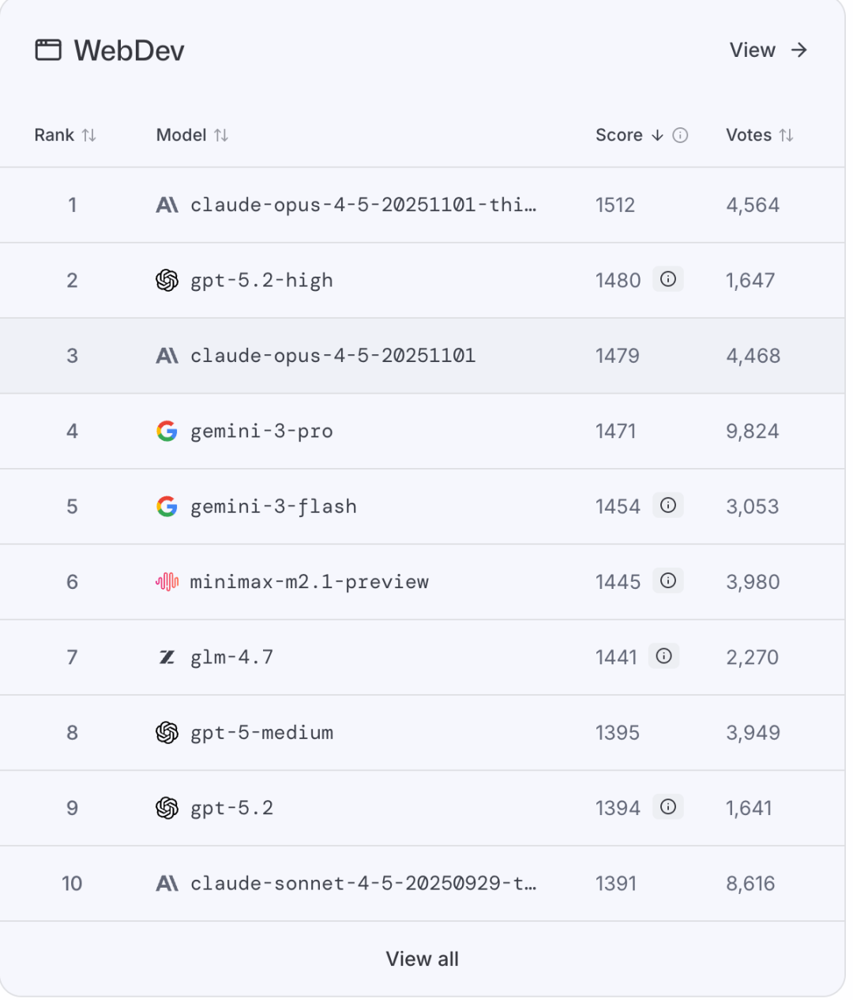
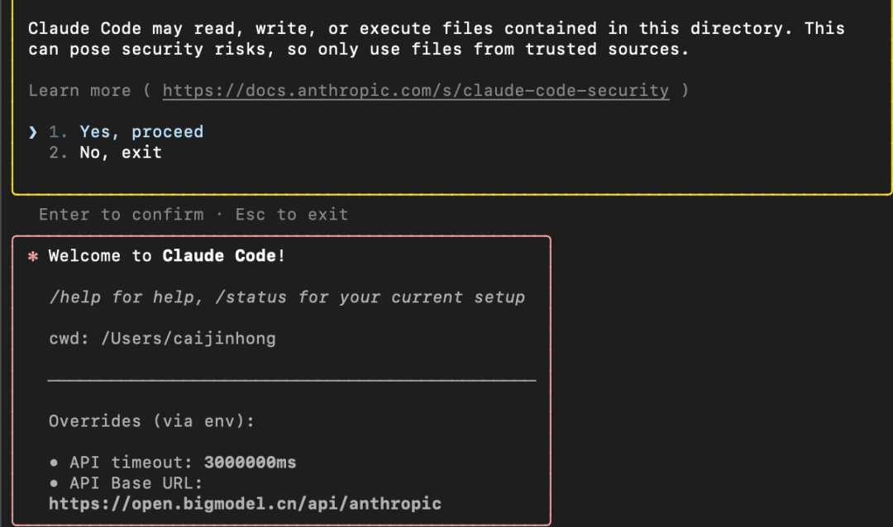
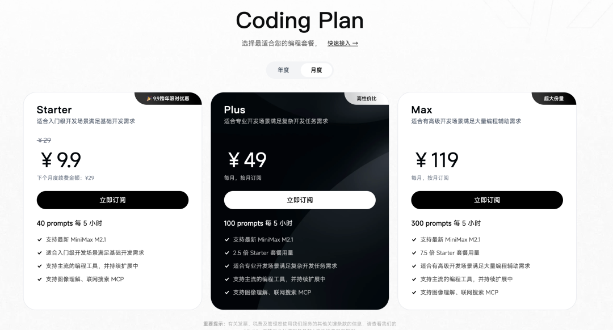
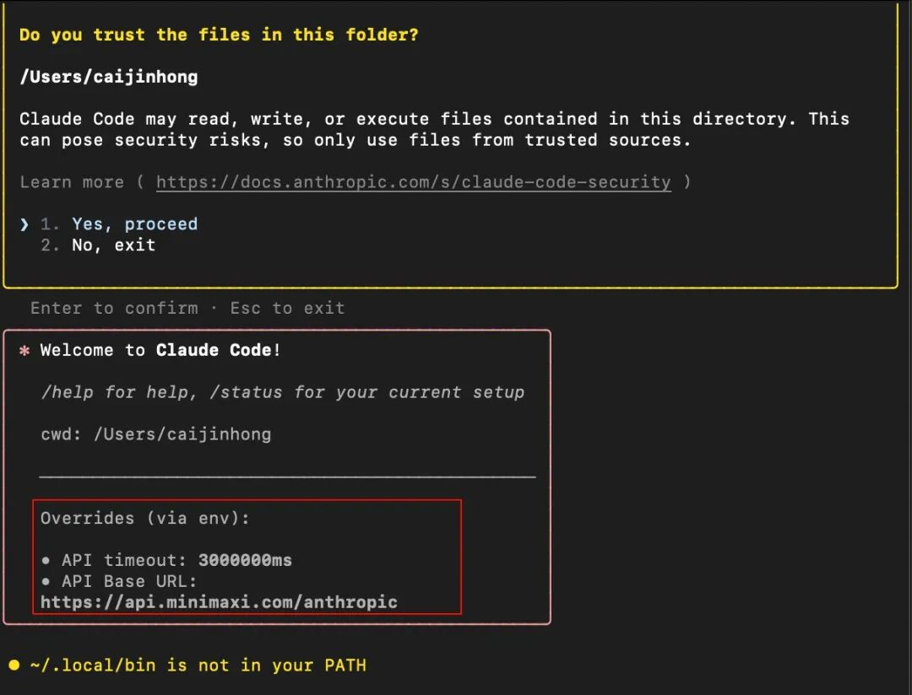

# 2026我只把一个 AI 工具用到极致，Claude Code

> 原文链接: https://mp.weixin.qq.com/s?__biz=Mzk4ODQyMTMyMQ==&mid=2247487286&idx=1&sn=544b1fc0790e5a2cda5b043a282372d5&chksm=c4f8fc791e11e893c8236cb99c55682a408821fb44240ec7fc8c356e933fdde6dfba0c8693d6&mpshare=1&scene=24&srcid=0119R6yRZIbIqZR7V57wFMvl&sharer_shareinfo=5d91519b32709a08150e037ed91489a7&sharer_shareinfo_first=5d91519b32709a08150e037ed91489a7#rd
> 图片状态: 已本地化 (assets/)

---

2026年，如果只推荐你学习一个AI工具，我一定强推Claude Code。

很多人一听到 Claude Code，下意识就会觉得，这东西肯定和编程有关，只适合程序员。

但如果你真是这么理解的，那你将错过这个潘多拉魔法。

  

Claude Code 表面上看是写代码的工具，但它并不是专门给程序员用的，而是一个离计算机非常近的工具。也正因为离得足够近，它能做的事情反而变得非常多。只要是计算机能完成的事，理论上它都可以参与其中。

你可以把它当成工作助手，帮你处理那些重复、繁琐但又不得不做的事情；也可以把它当成学习搭子，陪你一起试错、拆解问题、验证想法；当然，你也可以用它来写代码，但这并不是前提条件。

武侠小说里常常有一个设定，真正厉害的武功，从来不是招式最多的那一种，而是最基础、最朴素的功法。因为它不限制你，反而给了你最大的发挥空间。Claude Code 对我来说，就是这样的一种工具。它没有帮你预设好你应该做什么，而是站在最接近计算机的位置，把选择权交还给你。

所以，这并不是一篇教你学编程的文章。

而是一次尝试，让你第一次真正把 AI 当成一个可以一起干活的工具。

而且我相信，这个工具适合大部分人。

你不需要看一行代码，也能学会怎么用它。

这次我先教会你如何拿起这把武器。

# Claude Code安装

如果你之前用过 Cursor、Trae、Qoder 这类工具，那只需要一步，将以下的内容发给AI助手，让AI帮你安装。

https://docs.anthropic.com/zh-CN/docs/claude-code/overview 参考文档，帮我安装Claude code

过程中可能需要你进行授权。

如果没有用过，那也没关系。

打开你的终端（Mac是终端，windows是powershell或者CMD）

Mac命令：
    
    
    curl -fsSL https://claude.ai/install.sh | bash

Windows PowerShell：
    
    
    irm https://claude.ai/install.ps1 | iex

Windows CMD：
    
    
    curl -fsSL https://claude.ai/install.cmd -o install.cmd && install.cmd && del install.cmd

成功以后，会提示：Claude Code successfully installed。

然后在终端里输入：Claude。

回车后出现Welcome to Claude Code。

  

这样就成功了，如果你本身订阅了Claude，直接输入 /login。

回车后选择Claude account with subsription，可以直接用订阅账号的额度。

但claude最强的模型太贵，而且对于国内用户来说不能直接使用。

# 模型接入

接下来推荐两个国产的大模型，分别是GLM 和 minimax。

GLM最新的4.7模型，minimax最新的M2.1模型，它们在 lmarena 排行榜上的表现已经超过了 GPT-5.2，目前分别排在第 6 和第 7 位。

  

如果你对模型的使用不是很苛刻，不一定非得用claude opus 4.5的thinking模型。

我自己日常用 GLM 4.7 开发一些小项目，完全够用。

以下两个二选一进行配置。

## GLM

### 第一步：获取 API Key

访问 https://open.bigmodel.cn/，进行注册/登陆。

之后点击右上角的控制台 -> API Key -> 添加新的API Key。

复制好这个Key。

### 第二步：一键配置 Claude Code

打开终端，执行下面这条命令：
    
    
    curl -O "https://cdn.bigmodel.cn/install/claude_code_env.sh" && bash ./claude_code_env.sh

终端上会提示，Please enter your ZHIPU API key。

这时候把刚才创建的API Key粘贴上去，回车。

  

### 第三步：验证是否成功

回车后，再次输入claude。

如果你看到配置里的 baseUrl 出现了 bigmodel，说明已经是在用GLM的模型了。

  

需要注意的是，GLM 需要订阅，否则会有速率和次数限制。

  

目前他们推出了 Coding Plan，首月 20 元，用量大概是 Claude Pro 的 3 倍，价格只有 1/7。

普通用户其实非常够用了。

🚀 用这个链接进行购买可以减少百分之10的金额。

https://www.bigmodel.cn/glm-coding?ic=Y1HZYCZUPU

20元的Lite套餐，每5小时大概是120次prompts，对普通用户应该是相当够用了。

## Minimax

  

先上套餐，月度套餐中，价格最低的是9.9一个月，但是每5小时只有40 prompts。如果只想体验一下的用户可以选择这个。

🚀 用该邀请链接可以享受9折优惠：

https://platform.minimaxi.com/subscribe/coding-plan?code=JfQALRYdEL&source=link

订阅完以后，访问https://platform.minimaxi.com/user-center/payment/coding-plan

在这里复制API Key。

  

修改 claude code的配置文件。

打开 settings.json 文件：

  * mac的路径是：~/.claude/settings.json
  * windows的路径是（用户名需要替换）：C:\Users\你的用户名\\.claude\settings.json

把下面内容整体覆盖进去，把 <MINIMAX_API_KEY> 换成你自己的 Key：
    
    
    {  
      "env":{  
        "ANTHROPIC_BASE_URL":"https://api.minimaxi.com/anthropic",  
        "ANTHROPIC_AUTH_TOKEN":"<MINIMAX_API_KEY>",  
        "API_TIMEOUT_MS":"3000000",  
        "CLAUDE_CODE_DISABLE_NONESSENTIAL_TRAFFIC":1,  
        "ANTHROPIC_MODEL":"MiniMax-M2.1",  
        "ANTHROPIC_SMALL_FAST_MODEL":"MiniMax-M2.1",  
        "ANTHROPIC_DEFAULT_SONNET_MODEL":"MiniMax-M2.1",  
        "ANTHROPIC_DEFAULT_OPUS_MODEL":"MiniMax-M2.1",  
        "ANTHROPIC_DEFAULT_HAIKU_MODEL":"MiniMax-M2.1"  
    }  
    }

配置完成后，在终端运行claude。

如果 baseUrl 显示的是 minimax，并且能正常对话，说明配置成功。

  

# 插件推荐

如果你不喜欢这种命令行的模式，推荐在 vscode/trae/cursor 等 IDE中使用 Claude Code 插件。

是以一个chatbot的形式，和Claude code进行交互，相比于终端命令行输入的方式，这种对于小白用户来说更加的友好。

  

# Ending

从这一刻开始，Claude Code 不再只是一个工具，而是一个你可以长期合作的搭档。你可以用它来做 PPT、整理资料、处理文件、自动化那些你早就不想再亲手去做的重复工作。你可以是产品经理、运营、创作者、学生，甚至只是一个想把电脑用得更顺的人，它都能参与进来。

你不需要给自己贴上“程序员”或者“非技术人员”的标签。在 Claude Code 面前，这些身份并不重要。重要的是，你终于拥有了一个真正靠近计算机、却又能听懂人话的入口。

而这，还只是开始。

接下来我会继续分享，如何在 Claude Code 里使用 subagent、skills，让它更好的帮你完成现实世界中的任务，一步步把你的双手解放出来。

当你走到这一步的时候，你会明白一件事：

你学到的不是某个 AI 工具，而是一种全新的工作方式。 

最后提一下，我最近想做一个 AI 工具共创使用群，不是聊概念、追热点，而是大家一起把 AI 工具真正用好。

一起试工具、跑场景、拆用法、变现，把 AI 变成日常工作里顺手、变现的工具、靠谱的搭档。

如果你想加入，后台私信我，我拉你进群。

  

  

