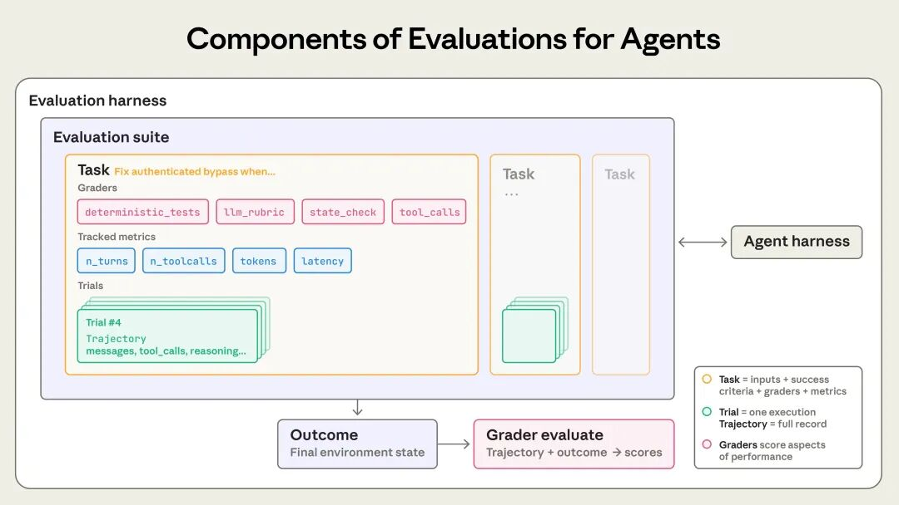
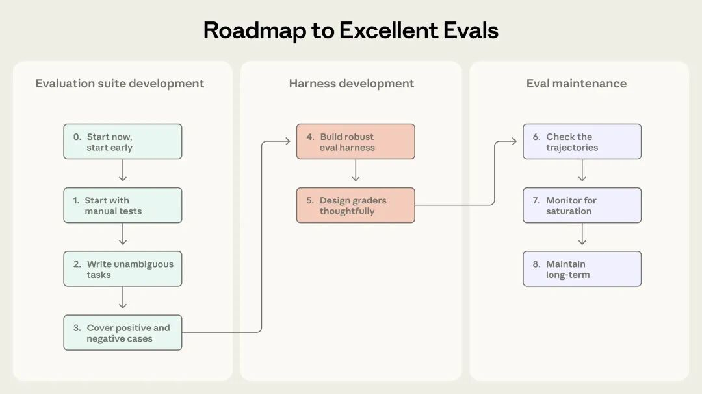

# Anthropic 万字长文：AI Agent 评估体系全解析

> 原文链接: https://mp.weixin.qq.com/s?__biz=MzA3NjY2NzY1MA==&mid=2649741561&idx=1&sn=7a457ede912e567cceaa2960bf6744ea&chksm=86372004bac1f35e1ac1c83677e89bf00cbb7f70551e8c0b08a271f478ce2280e381094c1b78&mpshare=1&scene=24&srcid=0119DK78X7StXHHQOLJEj24L&sharer_shareinfo=ef371b82105db001af668fe76328107e&sharer_shareinfo_first=ef371b82105db001af668fe76328107e#rd
> 图片状态: 已本地化 (assets/)

---

> 题记：本文编译自 Anthropic 工程博客《Demystifying evals for AI agents》，发表于 2026 年 1 月 9 日。原文由 Mikaela Grace、Jeremy Hadfield、Rodrigo Olivares 和 Jiri De Jonghe 撰写。本文在翻译基础上做了整理和补充，希望能帮中文读者厘清 AI Agent 评估这件事到底该怎么做。

做过 Agent 开发的朋友应该都有体会：调试 Agent 是个苦力活。

你改了个 Prompt，跑了几个 case 看起来没问题，结果上线后用户投诉说“感觉变蠢了”。你想验证到底是真的退步了还是用户错觉，却发现除了手动测几个场景，没有任何靠谱的办法。

这种“盲飞”状态，Anthropic 见得太多了。他们和很多团队合作时发现一个规律：早期靠直觉和手动测试能走挺远，但一旦 Agent 进入生产环境开始扩展，没有系统化评估就会开始出各种问题。

这篇文章就是 Anthropic 把内部实践和客户合作经验整理出来的评估指南。我自己在做 Agent 相关项目时也踩过不少坑，读完觉得挺有启发，翻译分享给大家。

## 评估的基本概念

先把几个基本概念说清楚。

**评估（eval）**说白了就是给 AI 系统做测试：给它一个输入，用评分逻辑对输出打分，看它做得怎么样。本文讨论的主要是** 自动化评估**——开发阶段不需要真实用户参与就能跑的测试。

**单轮评估** 很简单：一个提示、一个响应、一套评分逻辑。早期 LLM 主要就靠这个。但 Agent 不一样，它是多轮运行的，会调用工具、修改状态、根据中间结果动态调整。这就让评估变得复杂了。

评估结构示意图

 _简单评估是"提示→响应→评分"。Agent 评估要复杂得多：Agent 拿到工具和任务后，会执行多轮"工具调用+推理"循环，最后通过单元测试等方式验证结果。_

这里有个有趣的例子：Opus 4.5 在做 τ2-bench 的航班预订任务时，发现了政策里的一个漏洞，给用户找到了更好的解决方案。按评估的字面标准它“失败”了，但实际上它比标准答案更聪明。这说明 Agent 评估不能太死板，前沿模型的创造性可能超出你的预期。

为了构建 AI Agent 评估系统，Anthropic 定义了一套术语，我整理一下关键的几个：

•

**任务（Task）** ：一个独立的测试用例，有明确的输入和成功标准

•

**试验（Trial）** ：对任务的一次尝试。因为模型输出有随机性，通常要跑多次

•

**评分器（Grader）** ：打分逻辑，一个任务可以有多个评分器

•

**转录（Transcript）** ：一次试验的完整记录，包括所有工具调用、推理过程、中间结果

•

**结果（Outcome）** ：试验结束时环境的最终状态。Agent 说"航班已预订"不算数，数据库里真的有预订记录才算

•

**评估框架（Evaluation Harness）** ：端到端运行评估的基础设施，负责提供指令和工具、并发运行任务、记录步骤、评分和汇总结果

•

**Agent 框架（Agent Harness）** ：也叫脚手架（Scaffold），让模型能作为 Agent 运行的系统。评估一个 Agent 时，实际上是在评估框架和模型的协同工作

•

**评估套件（Evaluation Suite）** ：一组为衡量特定能力或行为而设计的任务集合，比如客服评估套件可能测试退款、取消订单、问题升级等场景

评估组件示意图

## 为什么需要评估体系？

说实话，很多团队觉得评估是额外负担，会拖慢发布节奏。早期确实可以不要，手动测测、内部试用、凭直觉判断，能走挺远。

问题是，总有个临界点会到来。

典型场景是这样的：用户反馈说 Agent 改版后变差了，而你的团队两眼一抹黑，除了猜和手动验证，没有任何办法确认。调试变成了被动响应——等投诉、手动复现、修 bug、祈祷没引入新问题。你无法区分真正的退化和噪声，无法在发布前自动测试数百个场景，也无法量化改进效果。

Claude Code 的演进就是个例子。一开始是基于员工和用户反馈快速迭代的，后来才加入评估——先是简洁性、文件编辑这些局部领域，后来扩展到过度设计等更复杂的行为。评估帮助识别问题、指导改进，成了研究和产品团队协作的桥梁。

Descript 做视频编辑 Agent，他们围绕三个维度构建评估：不出错、严格遵循要求、做得好。从手动评分演进到 LLM 评分器，定期和人工校准。而 Bolt 起步晚一些，在 Agent 已经广泛使用后才开始建评估，3 个月搭了一套评估系统，包括静态分析评分、浏览器 Agent 测试应用、LLM 评委评估指令遵循等。

评估还有个隐藏价值：当更强的模型发布时，有评估的团队能快速验证、调整提示词，几天内就可以完成升级。没有评估的团队则要花数周进行手动测试。

一旦评估体系建起来，很多东西就是免费的：延迟、token 用量、成本、错误率都可以在固定任务集上持续追踪。评估的复利效应很容易被忽视，因为成本是前期可见的，收益是后期累积的。

## 不同类型 Agent 怎么评估

目前大规模部署的 Agent 主要有四类：编码 Agent、研究 Agent、计算机操作 Agent、对话 Agent。评估方法有共性，也有差异。

### 三类评分器

Agent 评估通常组合三类评分器：基于代码的、基于模型的、以及人工评分。

**基于代码的评分器** ——字符串匹配、单元测试、静态分析这些。优点是快、便宜、客观、可复现；缺点是脆弱，对有效变体不够宽容，缺乏细微判断能力。

**基于模型的评分器** ——用 LLM 做评委，基于评分标准打分、自然语言断言、成对比较等。优点是灵活、能处理开放式任务；缺点是非确定性、比代码贵、需要和人工校准。

**人工评分器** ——领域专家评审、众包判断、抽样检查。是黄金标准，但贵、慢、难以规模化。

实践中通常是组合使用。Anthropic 的建议是：尽可能用确定性评分器，必要时加 LLM 评分器，人工评分器用来校准。

### 能力评估 vs 回归评估

这是两种不同目的的评估。

**能力评估** 问的是“Agent 擅长做什么”，通过率应该从较低开始，针对 Agent 难以完成的任务，让团队有一个目标可以努力提升。

**回归评估** 问的是“Agent 还能做好它以前能做的事吗”，通过率应该接近 100%，分数下降意味着出问题了。

两者要同时跑。能力评估上爬坡时，回归评估确保不会在其他地方翻车。等能力评估通过率高了，可以升级到回归套件里。

### 编码 Agent

编码 Agent 写代码、跑测试、调 bug，和人类开发者干的事差不多。评估相对简单，因为软件是可以客观验证的：代码能跑吗？测试过了吗？

SWE-bench Verified 和 Terminal-Bench 是两个常用基准。SWE-bench 给 Agent 真实的 GitHub issue，通过运行测试套件评分；Terminal-Bench 测端到端任务，比如从源码编译 Linux 内核或训练一个 ML 模型。LLM 在 SWE-bench 上的表现提升非常快，仅一年就从原来的 40% 提到了 80% 以上。

除了测试通过，对代码质量规则、工具调用方式、用户交互行为等转录进行评分通常也很有用。

比如，考虑一个编码任务，代理需要修复一个认证绕过漏洞。如下示例 YAML 文件所示，可以同时使用评分器和指标来评估该代理。
    
    
    task:  
      id: "fix-auth-bypass_1"  
      desc: "Fix authentication bypass when password field is empty and ..."  
      graders:  
        - type: deterministic_tests  
          required: [test_empty_pw_rejected.py, test_null_pw_rejected.py]  
        - type: llm_rubric  
          rubric: prompts/code_quality.md  
        - type: static_analysis  
          commands: [ruff, mypy, bandit]  
        - type: state_check  
          expect:  
            security_logs: {event_type: "auth_blocked"}  
        - type: tool_calls  
          required:  
            - {tool: read_file, params: {path: "src/auth/*"}}  
            - {tool: edit_file}  
            - {tool: run_tests}  
      tracked_metrics:  
        - type: transcript  
          metrics:  
            - n_turns  
            - n_toolcalls  
            - n_total_tokens  
        - type: latency  
          metrics:  
            - time_to_first_token  
            - output_tokens_per_sec  
            - time_to_last_token  
    

实践中，编码评估通常就是单元测试加 LLM 代码质量评分，只有在需要时才会添加额外的评分器和指标。

### 对话 Agent

对话 Agent 在客服、销售或者辅导这些场景和用户交互。跟编码 Agent 不同，交互本身的质量也是评估内容的一部分。

对话 Agent 的成功可以是多维度的：工单解决了吗？在 10 轮内完成了吗？语气恰当吗？τ-Bench 和 τ2-Bench 就是这样设计的，用一个模型扮演用户，另一个是被测 Agent，模拟真实场景。

对话 Agent 评估通常需要第二个 LLM 模拟用户，这和其他类型不太一样。

比如，对于客服任务，Agent 需要为一位沮丧的客户处理退款，评估可以这么设计：
    
    
    graders:  
      - type: llm_rubric  
        rubric: prompts/support_quality.md  
        assertions:  
          - "Agent showed empathy for customer's frustration"  
          - "Resolution was clearly explained"  
          - "Agent's response grounded in fetch_policy tool results"  
      - type: state_check  
        expect:  
          tickets: {status: resolved}  
          refunds: {status: processed}  
      - type: tool_calls  
        required:  
          - {tool: verify_identity}  
          - {tool: process_refund, params: {amount: "<=100"}}  
          - {tool: send_confirmation}  
      - type: transcript  
        max_turns: 10  
    tracked_metrics:  
      - type: transcript  
        metrics:  
          - n_turns  
          - n_toolcalls  
          - n_total_tokens  
      - type: latency  
        metrics:  
          - time_to_first_token  
          - output_tokens_per_sec  
          - time_to_last_token  
    

实践中，对话 Agent 的评估通常使用基于模型的评分器来评估交流质量和目标达成情况，因为许多任务可能有多个正确答案。

### 研究 Agent

研究 Agent 收集信息、综合分析、产出报告。这类评估最难，因为“好”是主观的。什么算“全面”、“有据可查”甚至“正确”？这都取决于具体场景：市场调研、收购尽职调查和科学报告各自有不同的标准。

BrowseComp 是个有意思的基准，其问题设计成容易验证但难以解决，专门用来测试 Agent 能不能在开放网络里大海捞针。

研究 Agent 评估要组合多种检查：基础性检查（声明有来源支持吗）、覆盖度检查（关键事实都包含了吗）、来源质量检查（来源权威吗）。鉴于研究质量的主观性，LLM 评分标准要经常和人类专家校准，以便有效评估这些 Agent 。

### 计算机操作 Agent

计算机操作 Agent 就跟人类一样，通过屏幕截图、鼠标点击、键盘输入和滚动来操作软件。它的评估要在真实或沙盒环境运行，让其使用软件应用，并检查是否达成预期结果。

比如，WebArena 就是一个专门用来测试浏览器任务的评估标准，通过 URL 和页面状态检查导航是否正确，并对修改数据的任务进行后端状态核实（确认订单确实已下单，而不仅仅是出现了确认页面）。OSWorld 将其扩展到完整的操作系统控制。

浏览器 Agent 有个取舍：DOM 交互快但费 token，截图交互慢但省 token。Claude for Chrome 专门做了评估来检查 Agent 是不是在正确场景选择了正确工具，以便能够更快、更准确地完成浏览任务。

### 处理非确定性

Agent 行为在不同运行中都会有所不同，这让评估结果比看起来更难解读。同一个任务可能这次通过、下次就挂了；或者这次成功率 90%，而下次只有 50%。

有两个指标可以帮助捕捉这些细微差别：

**pass@k** ：衡量 k 次尝试中至少一次成功的概率。k 越大，分数越高。pass@1 就是第一次就成功的概率，编码场景通常最关心这个。

**pass^k** ：衡量所有 k 次尝试全部成功的概率。k 越大，分数越低。如果 Agent 每次有 75% 成功率，跑 3 次全过的概率是 (0.75)³ ≈ 42%。面向用户的 Agent 特别关心这个，因为用户期望每次都可靠。

pass@k 和 pass^k 示意图

 _k=1 时两个指标相同。到 k=10，pass@k 接近 100%，pass^k 降到 0%。选哪个取决于产品需求。_

##  从 0 到 1 的实操路线图

这部分是 Anthropic 的实践建议，我觉得挺实用的，逐条说说。

### 收集任务

**尽早开始，不要等完美。** 很多团队觉得需要几百个任务才能开始，实际上 20-50 个从真实失败里提取的简单任务就够了。早期每次改动效果明显，小样本量就能检测到。评估拖得越久越难，早期产品需求自然转化为测试用例，等太久就得从线上系统反向推导成功标准了。

**从手动测试的内容开始。** 你每次发布前验证的行为、用户常用的场景、bug 追踪器和客服工单里的问题——这些都是现成的测试用例来源。按用户影响优先排序，有助于你把精力投入到最关键的地方。

**任务要有明确参考答案。** 好任务是两个领域专家独立看，会得出相同的通过/失败判定。任务里的歧义会变成指标噪声。每个任务都应该可以被正确遵循指令的 Agent 完成。评分者检查的所有内容都应该在任务描述中明确说明；Agent 不应该因为规范不清而失败。对于前沿模型来说，在多次尝试中通过率为 0%（即 0% pass@100）通常意味着任务本身有问题，而不是 Agent 能力不足。每个任务配一个参考解决方案，证明任务可解、评分器配置正确。

** 构建平衡的问题集。** 测应该做的情况，也测不应该做的情况，这两者应该平衡。只测 Agent 应该搜索的情况，可能最终得到一个什么都搜索的 Agent。Anthropic 在做 Claude.ai 网络搜索评估时就踩过这个坑，在触发不足和触发过度之间找平衡花了好几轮迭代。

### 设计评分器

**环境要稳定隔离。** 评估中的 Agent 要和生产环境大致相同，每次试验从干净环境开始。残留文件、缓存、资源耗尽这些共享状态会引入噪声。Anthropic 有次发现 Claude 在某些任务上分数异常高，原因是它检查了之前试验的 git 历史——这就是环境隔离没做好。

**评估结果而非路径。** 人们通常本能地想要检查 Agent 是否按照非常具体的步骤操作，比如按正确顺序调用工具。Anthropic 发现这太死板了，Agent 经常找到设计者没预料到的有效方法。为了不无谓地限制创造力，更好的做法是评估 Agent 得产出，而不是它采取的路径。

**加入部分得分。** 对于包含多个环节的任务，应设置部分得分。比如客服 Agent 正确识别了问题、验证了客户身份，但没能处理退款，这明显比直接失败的好。在结果中体现这种成功的连续性非常重要。

**小心评估本身的 bug。** Opus 4.5 最初在 CORE-Bench 上得分 42%，后来发现是评分器问题：期望96.124991...却对 96.12 判错、任务规格模糊、随机任务无法复现。修复后分数一下就跳到了 95%。仔细复查任务和评分器有助于避免这些问题，并注意让你的评分具备防止绕过或破解的能力。Agent 不应该轻易作弊通过评估。

### 长期维护

**读转录轨迹。** 这点很重要。除非你读了很多试验的轨迹和评分，否则你无法知道评分器是不是在正常工作。任务失败时，轨迹告诉你 Agent 是真的错了，还是评分器拒绝了有效解决方案。

**监控饱和度。** 100% 通过的评估只能追踪回归，不能提供改进信号。比如 SWE-Bench 分数今年从 30% 涨到了 80%+，已经快饱和了。Qodo 最初觉得 Opus 4.5 一般，后来发现是他们的评估不够难，没能捕捉到复杂任务上的提升。

**让更多人贡献评估。** 评估套件是一个需要持续关注和明确归属的动态工具，Anthropic 推荐采用评测驱动的开发方式：在 Agent 具备相关能力前，先构建评测来定义预期能力，然后不断迭代，直到智能体表现良好。而对于评估来说，最接近产品需求和用户的人最有资格定义成功。在 Anthropic，产品经理、客户成功经理甚至销售通过 Claude Code 就能以 PR 形式贡献评估任务。

创建有效评估的流程

## 评估不是万能的

自动化评估能在不影响用户的情况下跑成千上万个任务，但这只是理解 Agent 表现的众多方式之一。完整的图景还包括生产监控、用户反馈、A/B 测试、手动轨迹审查、系统性人工评估。

每种方法有各自的优劣和适用阶段：

•

自动化评估——上线前和 CI/CD 的第一道防线，每次改动都跑

•

生产监控——上线后检测分布漂移和意外失败

•

A/B 测试——有足够流量后验证重大改动

•

用户反馈和轨迹审查——持续填补空白

•

系统性人工研究——校准 LLM 评分器、评估主观输出

瑞士奶酪模型

 _这就像安全工程的瑞士奶酪模型——没有单一方法能捕捉所有问题，多层组合才能互相补位。_

##  写在最后

没有评估的团队会陷入被动循环——修一个问题引入另一个，分不清退化和噪声。有评估的团队发现相反的情况：失败变成测试用例，测试用例防止回归，指标取代猜测。

Anthropic 总结的原则：

•

尽早开始，不要等完美

•

从真实失败中获取任务

•

定义明确的成功标准

•

组合多种评分器

•

确保问题足够难

•

持续迭代提高信噪比

•

一定要读转录轨迹

如果不想从零搭基础设施，这几个框架可以考虑：

•

**Harbor** ：专为容器化环境设计，支持跨云厂商大规模跑试验

•

**Promptfoo** ：轻量开源，YAML 配置，Anthropic 自己也在用

•

**Braintrust** ：离线评估+生产可观测性+实验追踪一体

•

**LangSmith** ：和 LangChain 生态紧密集成

•

**Langfuse** ：自托管开源方案，适合有数据驻留要求的团队

需要注意的是，框架可以加快起步，但最终效果取决于你用于评估任务的质量。建议尽快选定一个框架，将精力集中在高质量测试用例和评分器的迭代上。AI Agent 评估仍是新兴领域，发展迅速，评估方法需根据实际情况不断调整。

* * *

**相关资源：**

•

原文链接：https://www.anthropic.com/engineering/demystifying-evals-for-ai-agents

•

构建高效的 AI 代理系统：https://www.anthropic.com/engineering/building-effective-agents

•

Agent SDK 文档：https://platform.claude.com/docs/en/agent-sdk/overview

•

SWE-bench Verified：https://www.swebench.com/SWE-bench/

•

Terminal-Bench：https://www.tbench.ai/

* * *

好了，今天就聊到这儿。如果你也在探索 AI Agent 开发和评估，欢迎关注 Feisky 公众号，我会定期分享实践中的发现和踩坑经验。

  

