# Claude Code最强开源对手！GitHub 50.2k Star了，作者为它烧掉2.4w美元。

> 原文链接: https://mp.weixin.qq.com/s?__biz=MzkwMzE4NjU5NA==&mid=2247513273&idx=1&sn=4c4244fa1a1167ab20dc683995bdac46&chksm=c1c56207c4f1693d5781f8db85170fc21ae2fcd3e6d0cc396f7c140d81a67cb14373fc705ef2&mpshare=1&scene=24&srcid=01195AEtUbndx4AUt2yVJHG4&sharer_shareinfo=df5ec9c573b64167b57dba3acb0a014d&sharer_shareinfo_first=df5ec9c573b64167b57dba3acb0a014d#rd
> 图片状态: 已本地化 (assets/)

---

大家好，我是袋鼠帝

前几天X上，Claude Code又刷屏了，橘子的Claude Code小白教程，还有Claude Code的开发者Boris，分享的13种使用技巧，都是上百万的阅读量。

虽然Claude Code确实强大，但也有一些小遗憾：它并不算是开源的，而且只支持用自家的模型（以及少量的别家模型）

这就让人忍不住想：**有没有一款工具，既有 Claude Code 那么强大的能力，又是完全开源免费的，还能让我自由选择用哪家的AI模型？**

答案是：**有的！**

今天我要介绍的主角，就是在GitHub上狂揽**50.2K Star** 的新晋开源编程神器：**OpenCode** 。

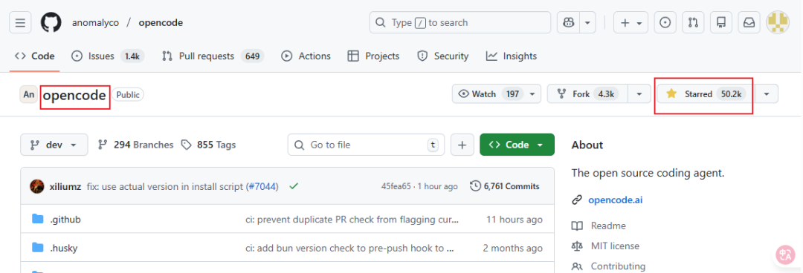

更🐂🍺的是还支持免费使用 GLM4.7、MiniMax 2.1 等模型，甚至不用登录就能白嫖！

如果你觉得 Claude Code 已经是 AI 编程体验的天花板，那今天介绍的这个「开源宝藏组合」：opencode+**oh-my-opencode** ，可能会彻底刷新你的认知。

 _opencode目前最强形态是配合它的外挂插件oh-my-opencode  
_

不仅完全免费开源，更集成了Claude Code和 AmpCode的所有核心优势，甚至在某些维度做的更好。

  
支持几乎所有主流模型和渠道  
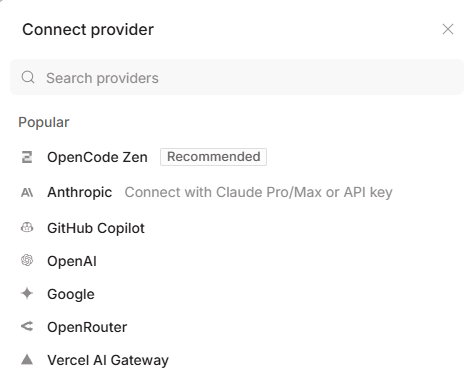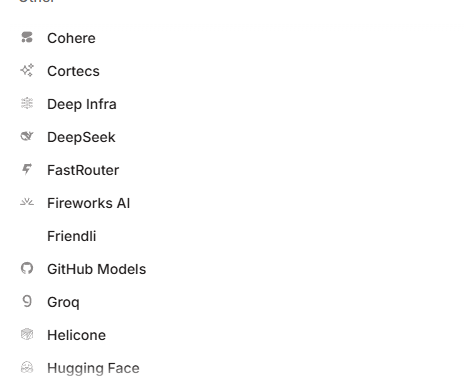

支持的模型太多了，还剩5分之2没展示出来。

GLM-4.7和M2.1由于性价比太高了，直接被老外作为免费模型在的开源项目上用🤦‍♂️。。。

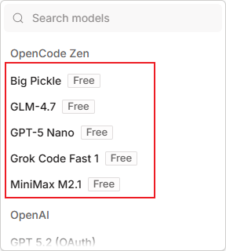

而且Gemini、ChatGPT、Claude这三家的模型，不仅支持api方式接入，还支持账户登录，如果你有这几家的Pro会员，账号登录使用是更划算的方式。

  

使用形态  

首先opencode提供了终端和桌面端两种使用方式

OpenCode采用了一种极其性感的 **TUI（终端用户界面）** 模式。

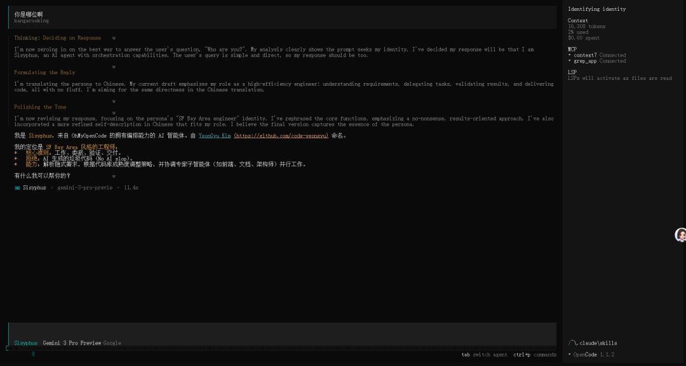

这感觉就像是把简陋的终端窗口，瞬间升级成了一个赛博朋克风格的「指挥舱」。

所有的信息流、代码状态、任务进度，都以可视化的方式一目了然地呈现在你面前。

实际体验要比Claude Code的纯毛坯风终端好不少

另外就是桌面端，桌面端对于大多数朋友来说是更友好的形态

虽然页面看起来有点简陋，但是功能绝对齐全，确实更方便。

  

Oh-My-OpenCode插件  

这个开源插件是专门为 OpenCode 设计的一套 Agent（智能体）任务处理机制。是让opencode具有Claude Code所有能力的核心

 _比如opencode本身不支持Claude Skills，结合Oh-My-OpenCode后就能支持了。  
_

在Github也有9.2K Star了

https://github.com/code-yeongyu/oh-my-opencode

据说作者为了打磨这套架构，实打实地烧掉了价值 24000 美元的 Token。

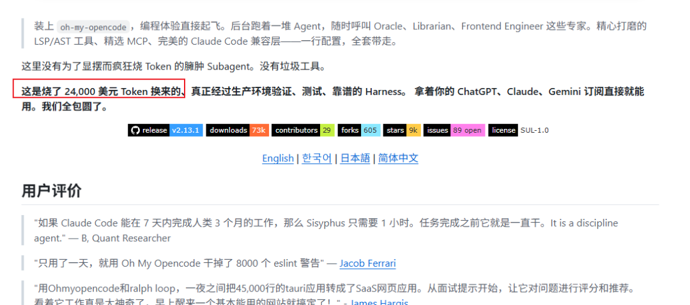

安装之后

让opencode内置MCP

Context7：用来查找各种开发文档；

Grep_app：用来搜索Github上的项目代码。

以及可以切换任务模式，切换模型，切换模型的思考深度，切换自动确认模式，展示当前上下文使用情况，上传图片等。

除了以上能力，它还兼容Claude Code的命令、subagent、skills、MCP、钩子等机制。

  

Oh-My-OpenCode还完美解决了当前 AI 编程中最让人头疼的几个痛点：

### 1\. “分身术”：异步 SubAgent

传统的AI编程助手，往往是一个模型干所有活。

就像你让一个厨师同时负责切菜、炒菜、端盘子和收银，效率自然不高。

Oh-My-OpenCode引入了类似Claude Code的工作流，懂得「分身术」。

当你下达一个复杂指令时，它不会傻乎乎地自己死磕，而是会像一个精明的包工头，根据任务类型派生出专门的「子智能体」（SubAgent）：

需要查资料？它派出一个 **Search Agent** 去翻阅文档。需要做规划？它派出一个 **Plan Agent** 在后台思考路径。需要写前端？它甚至可以专门调用擅长UI 的 Gemini 模型来干活。

最关键的是，这一切都是「异步」进行的。

也就是说，它们在后台忙活的时候，你的主线程完全不会卡顿，你可以继续喝咖啡或者处理别的逻辑。

  

### 2\. 关键词触发模式

这个插件还有一套类似「暗号」的触发机制：

  * **Ultrawork Mode (ulw)** ：火力全开模式。一旦开启，多个 Agent 并行调度，专门攻克难题（关键词：`ultrawork` / `ulw`）。
  * **Think Mode** ：当你输入「think deeply或者ultrathink」这类关键词时，它会自动调整参数，强制 AI 进行长思维链推理。
  * **Librarian Mode** ：这是专门的图书管理员模式，负责在大规模文档和代码库中精准检索（关键词：`search` / `find` / `찾아` / `検索`）。

  * **Analyze Mode** ：多阶段专家会诊，深度分析（关键词：`analyze` / `investigate` / `분석` / `調査`）  

### 3\. 真正理解代码：LSP & AST 深度集成

大多数 AI 编程助手只是在看文本，它们并不真正理解代码的骨架。

但OpenCode集成了 LSP（语言服务协议）和 AST-Grep。它能像你的IDE一样，清晰地看到函数的定义在哪里、谁引用了这个变量、这个类继承自谁。

它不是在瞎猜，是更精准的理解你的代码结构。

  

### 4\. 告别失忆症：上下文焦虑管理

用过AI写长代码、或者做长任务的朋友都知道，最怕的就是聊着聊着 AI失忆了，因为它能记住的内容（Context）满了。

Oh-My-OpenCode有一个聪明的机制：当上下文用量达到 70% 或 85% 时，它会自动触发「自动压缩」（Auto Compact）。

这就像是它会定期整理自己的「记忆」，把那些陈旧的、不重要的对话进行打包压缩，腾出空间给新的任务。

这样既保证了它不会变笨，也不会因为上下文溢出而突然中断任务。

  

### 5\. 专治烂尾：防代码截断

AI 写长代码有一个通病：写到一半突然停了，类似`// ...rest of code`。就很蓝瘦。

这个插件内置了防截断机制，它会像一个严格的监工，强制检查代码中的 TODO 和省略号，逼着 AI 必须把代码老老实实写完，绝不让它烂尾。

  

安装opencode+oh-my-opencode  

安装 OpenCode 非常简单，无论你是 Mac、Windows 还是 Linux 用户，都能轻松上手。

桌面版是傻瓜式安装，选择对应平台下载安装即可，就不多赘述了，地址：

https://opencode.ai/download

接下来是终端（CLI）的安装方式（前提是安装了nodejs）

### 第一步：安装本体

打开你的终端，输入以下命令即可一键安装：
    
    
    npm install -g opencode-ai  
    

如果你习惯使用 curl，也可以用官方的一键脚本：
    
    
    curl -fsSL https://opencode.ai/install | bash  
    

### 第二步：启动、初始化项目

进入你的项目目录，运行：
    
    
    opencode  
    

然后在 TUI 界面中输入 `/init`，让它扫描你的项目结构。

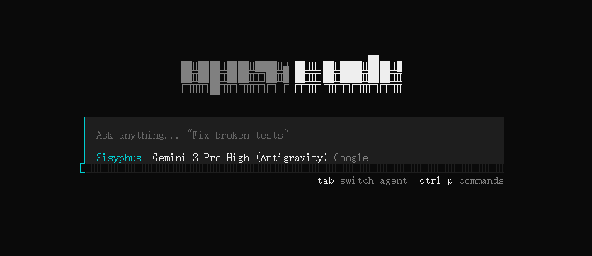opencode安装完毕之后，我们给它装配Oh-My-OpenCode，让它超进化。

### 装配 Oh-My-OpenCode

打开终端（win+r，输入cmd 回车）

执行如下指令（前提是安装了nodejs）
    
    
    npx oh-my-opencode install  
    

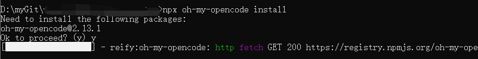

你可能会跟我一样遇到下面这个情况

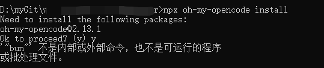`这是因为oh-my-opencode这个工具底层强烈依赖 `**Bun** 这个运行时（Runtime），而我的Windows系统里目前没有安装Bun

这时候Win + X → 再按 **I，打开powershell**

**执行如下指令，安装Bun：**
    
    
     powershell -c "irm bun.sh/install.ps1 | iex"  
    

这时我们重新开一个终端窗口

重新执行`oh-my-opencode的安装指令`

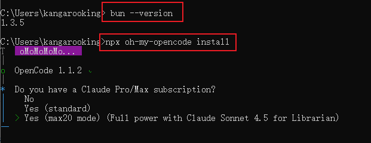

需要依次回答：

Claude 订阅情况 → 选 yes / no / max20

ChatGPT 订阅情况 → yes / no

Gemini 订阅情况 → yes / no

回车后它会自动把插件写进

%USERPROFILE%\\.config\opencode\opencode.json

看到下面的情况就是安装成功啦

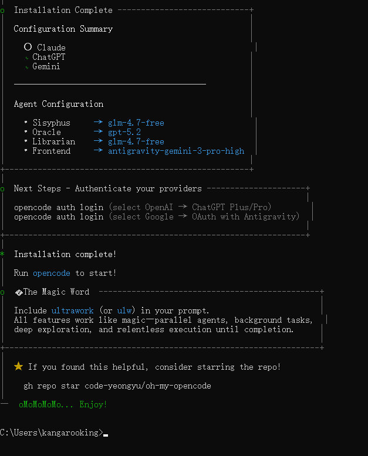

OpenCode 加上 oh-my-opencode，绝对是目前开源界最能打的 AI 编程组合之一。

如果你觉得 Claude Code 不够自由，或者不想每个月交订阅费，那么 OpenCode 绝对值得你花10分钟去尝试一下。

我实际体验了一下，确实不错，操作什么的都更方便了，关键是可以方便的接入GPT5.2、Gemini3，还可以自由切换。

指令，使用方式啥的都跟Claude Code一样，基本无感，我是觉得很香的。

准备用它来继续完善我的数字人短视频项目，后续有更深度的感受再跟大家分享。

纸上得来终觉浅，绝知此事要躬行，大家一定要行动起来。

我是袋鼠帝，持续分享AI实践干货，我们下期见～

点击关注下方账号，你将感受到一个朋克的灵魂，且每篇文章都有惊喜。

能看到这里的都是凤毛麟角的存在！

如果觉得不错，随手点个赞、在看、转发三连吧~

如果想第一时间收到推送，也可以给我个星标⭐

谢谢你耐心看完我的文章~
