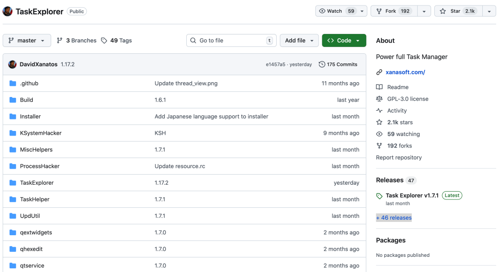
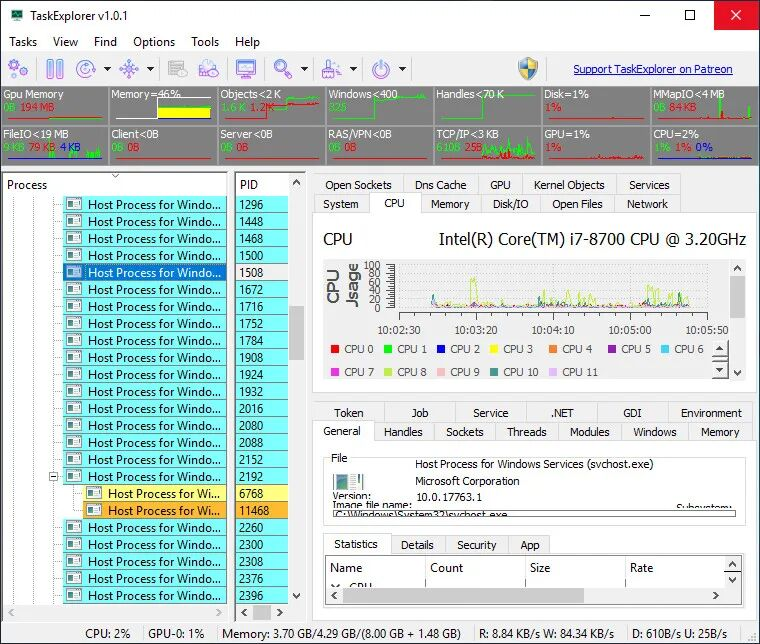

# 微软该学学了 ! 从Win7到Win11

> 原文链接: https://mp.weixin.qq.com/s?__biz=Mzg3NzU0NzIxMA==&mid=2247510325&idx=1&sn=301b6f77765cf18734758faebba23f4d&chksm=ce2a39bb50cd2b6af54402208c013cbe858850edfe746111f37973e84975537083fbca24324b&mpshare=1&scene=24&srcid=0119TrVcKZqpfDCITQ2o2ijM&sharer_shareinfo=0ed2f602776d8f7994d864bc3c075ae3&sharer_shareinfo_first=0ed2f602776d8f7994d864bc3c075ae3#rd
> 图片状态: 已本地化 (assets/)

---

  

最近在 GitHub 上看到一个挺有意思的项目，叫 TaskExplorer，算是一个加强版的任务管理器吧，它不只是能看哪些程序在跑，还能把每个程序背后在干什么，都给你看得清清楚楚。有时候电脑卡了，或者某个软件行为怪怪的，用系统自带的任务管理器，总觉得差点意思，只能看到谁在吃 CPU，谁在占内存，但具体为啥吃这么多，说不清楚

TaskExplorer 就把这些黑盒子给打开了，线程在干嘛，文件读写到哪了，网络连了谁，都能直接看，对于想折腾下电脑，或者排查点问题的人来说，这工具算是挺顺手的。

#### TaskExplorer是什么

> TaskExplorer 是一个面向 Windows 的、深度集成的系统监控与管理工具，它超越了传统任务管理器的简单进程列表，致力于提供进程行为的全景透视。通过其高效的界面设计，用户可以在一个窗口内实时洞察进程的线程栈、内存数据、文件句柄、网络连接等底层细节，旨在成为技术用户和系统管理员进行故障诊断、性能分析和安全审查的得力助手

#### 开源成就

  * **Star数** GitHub 上已经吸引了 **2.1k 星**
  * **主开发语言** C 和 C++

#### 核心功能

**线程堆栈透视**

选中一个进程后，直接就能看到它下面每个线程的调用堆栈，这功能对于排查程序卡死或者响应慢特别有用，你一眼就能看出来线程卡在哪个函数调用上等磁盘读写，还是等网络回应，还是锁住了，不用再去开其他调试工具

**内存查看与编辑**

提供了一个内置的十六进制内存编辑器，能直接查看和修改指定进程的内存数据，还支持字符串搜索，这对于分析程序内部数据结构、或者进行一些简单的内存补丁实验来说，算是把专业调试器的部分功能给搬过来了，不过操作上要直观不少

**句柄与文件监控**

能把进程打开的所有句柄都列出来，不管是文件、注册表键、还是事件、线程这些内核对象，对于文件句柄，会直接显示完整的路径、当前读写位置和文件大小，这样你就能清楚地知道某个软件到底在读写你的哪些文件，占着哪些资源不放

**网络连接可视化**

不仅显示 TCP/UDP 端口这些基本信息，还能通过 ETW 事件追踪来“推测”和显示无连接的 UDP 通信对端，同时提供实时的上下行数据速率，这对于分析软件的网络行为、监控后台流量很有帮助，比单纯看资源管理器里的网络占用要具体得多

**模块管理与注入**

除了列出所有已加载的 DLL 和内存映射文件，它还允许你卸载某些非核心的 DLL，或者向目标进程注入新的 DLL，这给高级用户提供了更强的控制能力，虽然用起来需要谨慎，但在某些调试或安全分析场景下是刚需

**系统级资源总览**

软件顶部有实时的系统资源图表，显示 CPU、内存、磁盘 I/O、网络和 GPU 的使用情况，下方的系统面板则可以总览全系统的文件、套接字，并能管理系统服务和驱动程序，相当于把一个轻量级的性能监视器和服务管理器给整合了进来，窗口布局还能自由折叠或分离，用起来挺灵活的

#### 安装指南

  * 项目提供了完整的源代码，你可以从 GitHub 仓库主页直接下载 ZIP 包，或者用 Git 克隆下来，不过编译它需要配置 Qt 等依赖环境，过程对新手可能有点复杂
  * 对于大多数用户，更简单的方式是直接使用作者打包好的安装程序，在 GitHub 的 Releases 页面能找到最新的安装包，比如 `TaskExplorer-v1.17.2-Setup.exe`，下载后像普通软件一样安装即可，它包含了所有必要的驱动和库文件
  * 软件需要管理员权限来运行，以便获取所有进程的完整信息，首次运行时可能会提示安装其专用的内核驱动程序，这是实现其深度监控功能所必需的，需要点击确认
  * 它支持从 Windows 7 到 Windows 11 的 32 位和 64 位系统，界面支持多国语言，安装程序里可以选择

    
    
    开源地址https://github.com/DavidXanatos/TaskExplorer  
    

近期热文:

[刚刚开源 ! 有潜力](<https://mp.weixin.qq.com/s?__biz=Mzg3NzU0NzIxMA==&mid=2247510312&idx=1&sn=218e855bed9cd557ea7eea3d87eb3f8e&scene=21#wechat_redirect>)[一定收藏 ！SVIP体验](<https://mp.weixin.qq.com/s?__biz=Mzg3NzU0NzIxMA==&mid=2247510298&idx=1&sn=77bc0f93032d16bd02d1ec2876bab5b6&scene=21#wechat_redirect>)[要火火火了 ! 这脑洞我服了](<https://mp.weixin.qq.com/s?__biz=Mzg3NzU0NzIxMA==&mid=2247510285&idx=1&sn=69da56f26a75fd4af4e407c00d9a59ca&scene=21#wechat_redirect>)[刚刚开源 ! 会计直呼内行](<https://mp.weixin.qq.com/s?__biz=Mzg3NzU0NzIxMA==&mid=2247510274&idx=1&sn=d4b9a561cf1e827c65b31b0f4727a427&scene=21#wechat_redirect>)[不越狱 ! 来得太及时](<https://mp.weixin.qq.com/s?__biz=Mzg3NzU0NzIxMA==&mid=2247510261&idx=1&sn=8390861897c45c387702586f25bf47ff&scene=21#wechat_redirect>)  
---  
  
  

