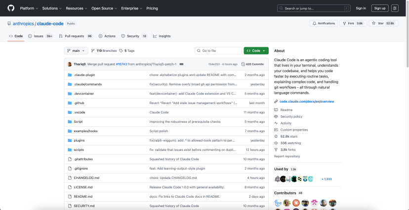
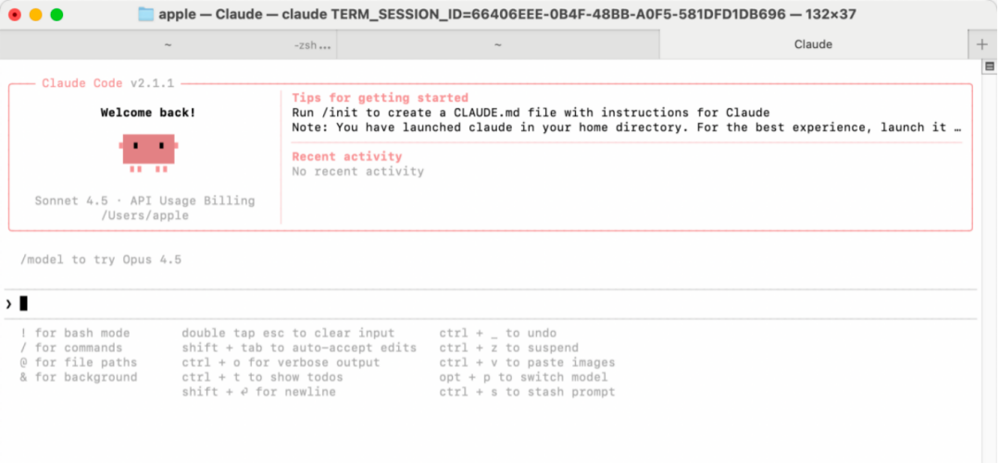

# 最强AI编程利器：Claude Code 国内使用完整方案（开源版本 + 国产模型）

> 原文链接: https://mp.weixin.qq.com/s?__biz=MzA5MzMyMDQ1MA==&mid=2247485998&idx=1&sn=700b4b9a04cad99aaffc922fe209f734&chksm=912612cc0af16984a1fa66d278ea8ec47ecf78aaf4ec8d68989c83b8bcd1c7097064b5a5adbb&mpshare=1&scene=24&srcid=0119lsdnqTRPEn9JAFQC1sj2&sharer_shareinfo=025dfa8095c0c32c577e0f5ddcd64883&sharer_shareinfo_first=025dfa8095c0c32c577e0f5ddcd64883#rd
> 图片状态: 已本地化 (assets/)

---

  
Claude Code是一款由Anthropic开发的终端（命令行）AI编程助手。它通过订阅Claude模型服务来工作。对于国内用户，核心解决思路是：安装官方命令行工具后，将其后端模型服务替换为国内可访问且API兼容的替代品。  
本教程旨在帮助国内开发者绕开网络限制，通过配置国产大模型，顺畅地使用强大的AI编程助手Claude Code。  
说明：Claude Code 没有完全开源的版本，但其核心命令行工具是开源的，并且社区有丰富的工具链支持在国内使用。  
一、环境准备

Claude Code 需要 Node.js 环境来运行

1，安装 Node.js (版本 ≥ 18.0)

# Ubuntu / Debian 用户

  *   * 

    
    
    curl -fsSL https://deb.nodesource.com/setup_lts.x | sudo -E bash -sudo apt-get install -y nodejs

2，macOS 用户 (使用 Homebrew)

# 如果没有安装 Homebrew，请先运行此命令

  *   * 

    
    
    /bin/bash -c "$(curl -fsSL https://raw.githubusercontent.com/Homebrew/install/HEAD/install.sh)"brew install node

3，Node版本验证 

  *   *   *   * 

    
    
    ➜  ~ node -v                                               v22.19.0➜  ~ npm -v                                  10.9.3 

  
二、Claude Code安装1，方式一：通过官方脚本安装# Mac用户：在终端执行 

  * 

    
    
    curl -fsSL https://claude.ai/install.sh | bash

# Windows用户：PowerShell执行 

  * 

    
    
    irm https://claude.ai/install.ps1 | iex

CMD依次执行

  * 

    
    
    curl -fsSL https://claude.ai/install.cmd -o install.cmd && install.cmd && del install.cmd

安装成功后，在终端输入 claude，看到 “Welcome to Claude Code” 即表示安装成功。注意：直接使用 /login 会连接官方付费服务，对国内用户不适用，因此我们进入下一步。2，方式二：使用NPM安装方式

  * 

    
    
    npm install -g @anthropic-ai/claude-code

3，验证安装  

# 安装后，可以运行以下命令来验证是否安装成功

  * 

    
    
    claude --version

# 启动claude

  * 

    
    
    输入：claude

三、对接国产大模型

如果对模型的使用不是很苛刻，不一定非得用claude opus 4.5的thinking模型，claude最强模型太贵，而且对于国内用户来说不能直接使用。  

这里推荐两个国产大模型：GLM 4.7、minimax M2.1，以下是两个主流方案的详细配置，这也是实现国内使用的关键。

1，方案一：对接智谱AI（GLM） - 推荐新手

  * 

    
    
    https://open.bigmodel.cn/

获取API Key：访问 智谱AI开放平台 注册并创建API Key。一键配置：在终端执行命令：

  * 

    
    
    curl -O "https://cdn.bigmodel.cn/install/claude_code_env.sh" && bash ./claude_code_env.sh

按提示粘贴API Key即可完成全部环境变量配置。验证：重新启动 claude，在对话中输入 /status 命令，查看输出中的 baseUrl 是否包含 bigmodel 字样。# 查看配置2，方案二：对接Minimax获取API Key：访问Minimax平台注册并创建API Key。手动配置：用文本编辑器打开配置文件：

  *   * 

    
    
    Mac: ~/.claude/settings.jsonWindows: C:\Users\你的用户名\.claude\settings.json

写入配置：将以下内容完整替换到文件中，并将 <MINIMAX_API_KEY> 替换为你自己的Key：

  *   *   *   *   *   *   *   *   * 

    
    
    {  "env": {    "ANTHROPIC_BASE_URL": "https://api.minimaxi.com/anthropic",    "ANTHROPIC_AUTH_TOKEN": "<MINIMAX_API_KEY>",    "ANTHROPIC_MODEL": "MiniMax-M2.1",    "ANTHROPIC_SMALL_FAST_MODEL": "MiniMax-M2.1",    "ANTHROPIC_DEFAULT_SONNET_MODEL": "MiniMax-M2.1"  }}

（配置已精简，保留最核心的几项即可，其余可删除）验证：重启 claude，输入 /status，确认 baseUrl 显示为 minimaxi。3，模型选择建议：对于日常开发和小项目，GLM-4或Minimax M2.1 等国产顶级模型已完全足够，性价比远高于Claude Opus，且无需担心网络问题。当然如果条件允许，或出于安全考量，可部署本地模型接入，接入方式类似，这就更nice！  
四、使用与优化1\. 在IDE中使用（提升体验）如果不习惯命令行，在VSCode、Cursor等编辑器中安装 Claude Code插件 是绝佳选择。它会以侧边栏聊天机器人的形式集成，可以直接对代码框选提问，交互更直观友好。2\. 注意事项API密钥安全：切勿将写有API Key的 settings.json 文件上传至公开的Git仓库。建议通过环境变量管理密钥。注意使用成本：国产模型多为按量付费，使用前请了解计费规则。初期可关注平台提供的免费额度。使用清晰指令：在终端中，给Claude Code的指令越具体，它的回答就越精准。例如，“解释一下这个函数的功能”比“看这段代码”更好。  
# 相关资源链接：开源仓库：https://github.com/anthropics/claude-code官方文档：https://docs.anthropic.com/en/docs/claude-code智谱AI Claude Code 配置指南：https://docs.bigmodel.cn/cn/coding-plan/tool/claudeMinimax 官方平台：https://api.minimaxi.com
