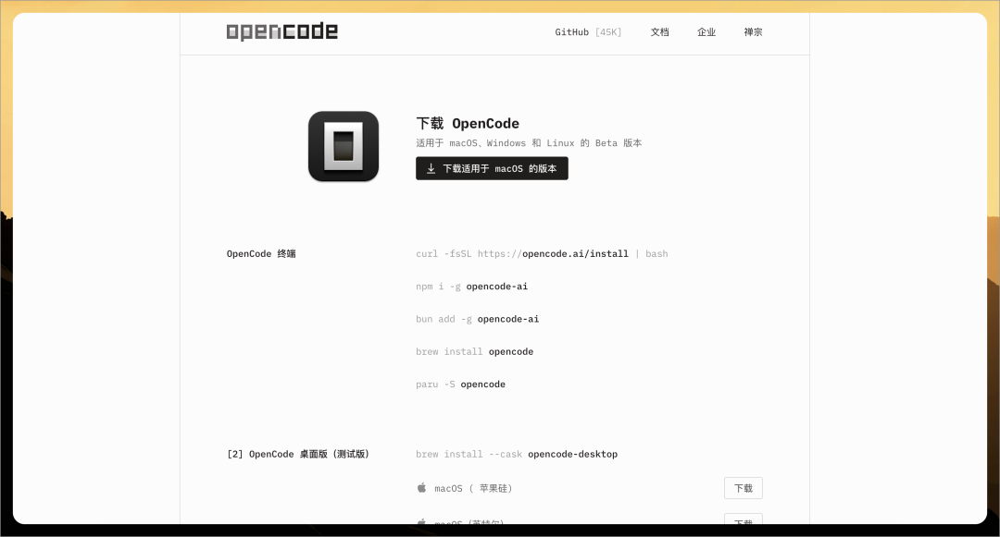
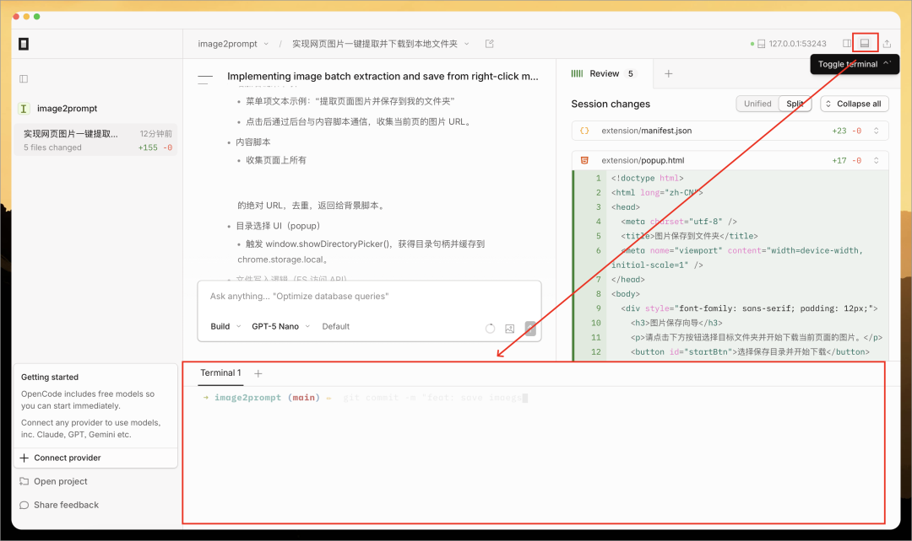
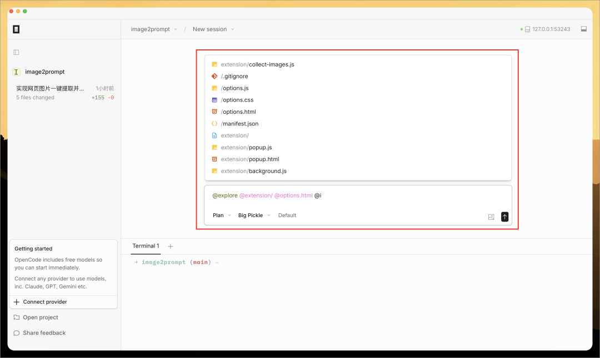
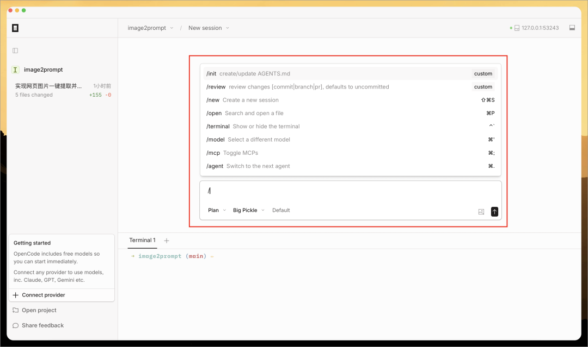
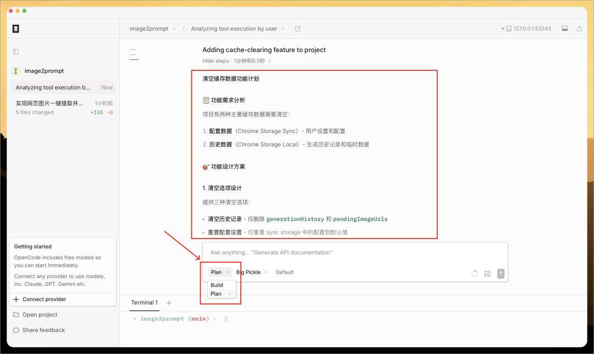
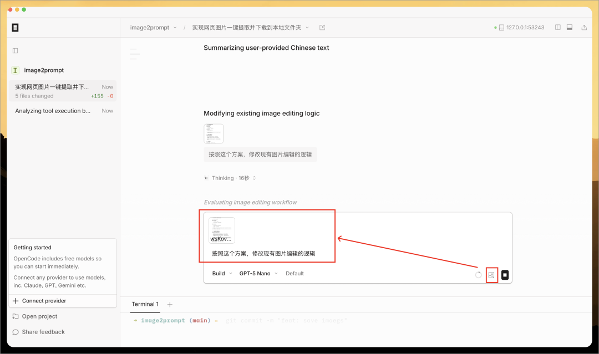
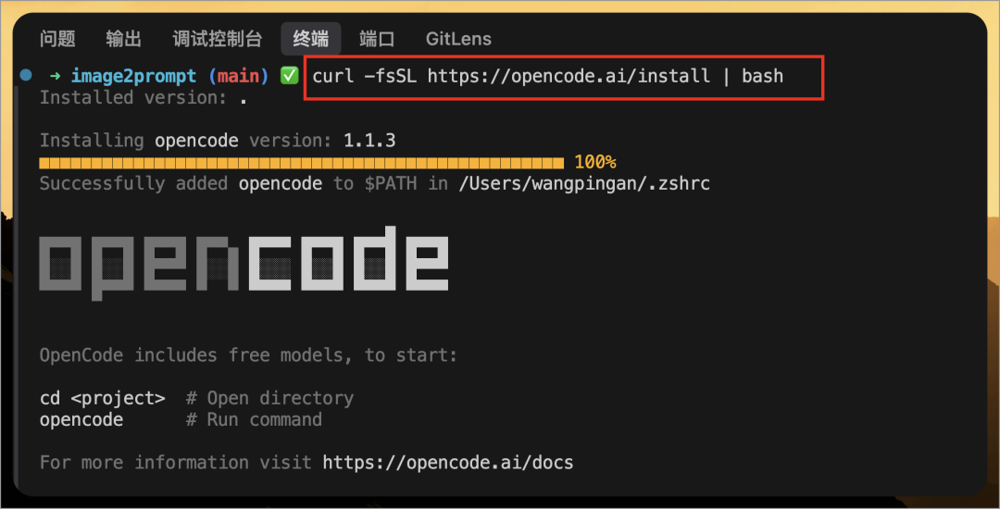
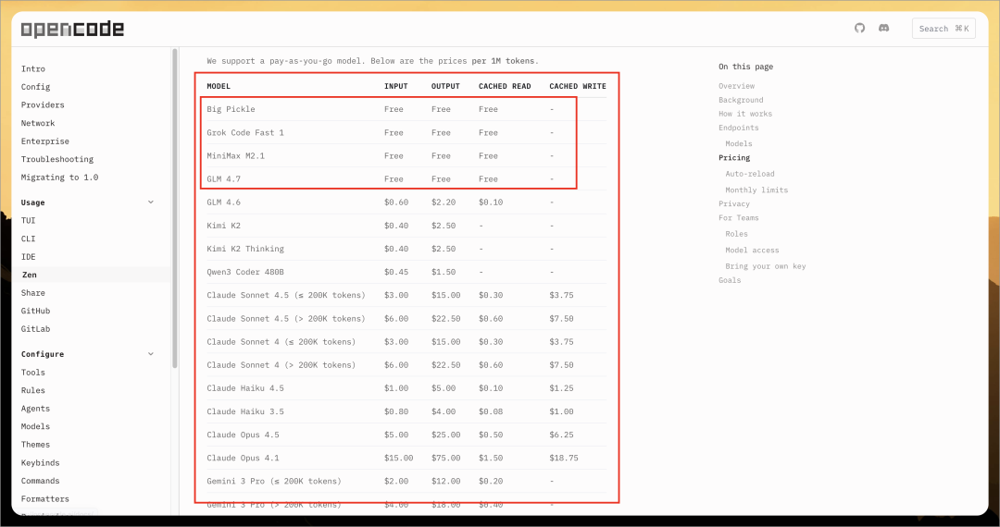
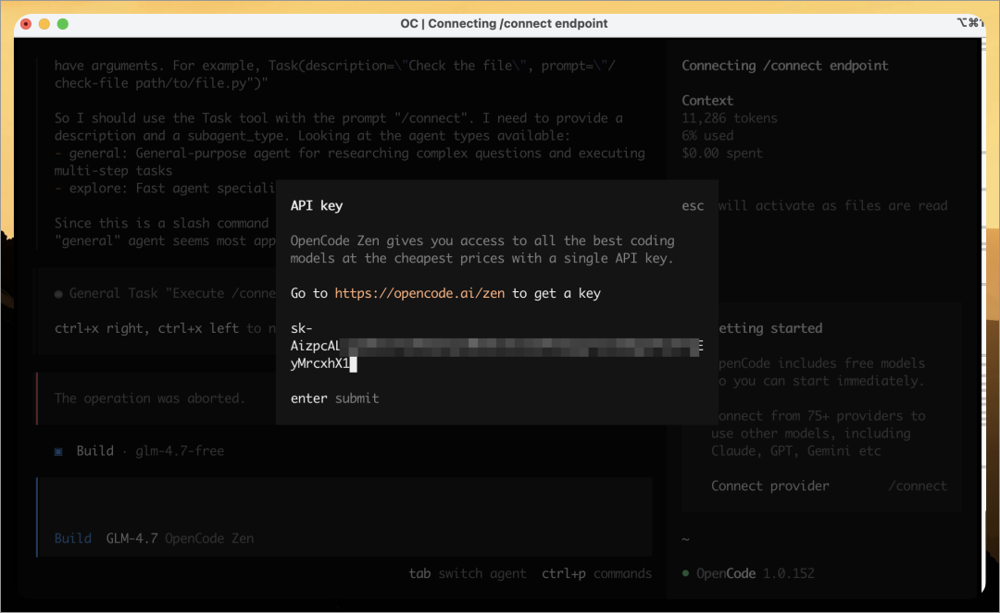

# OpenCode 超级详细入门指南，打造你的高效 AI 编程助手

> 原文链接: https://mp.weixin.qq.com/s?__biz=MzI3NDIwMzU3Ng==&mid=2655169162&idx=1&sn=3aaa7b00ec64613cceecbdfba4f4075a&chksm=f1f15538d5f819e2cdb3c6a4a87314b6993862f0ef4adb713ef51b8e987c618270aa09e200b8&mpshare=1&scene=24&srcid=0119qbJOlUTK6lYxJApWWLes&sharer_shareinfo=82773b8333d4537d13923b7c9f04a134&sharer_shareinfo_first=82773b8333d4537d13923b7c9f04a134#rd
> 图片状态: 已本地化 (assets/)

---

大家好，我是 **Chris** 。

作为一名摸爬滚打多年的程序员，最近半年我将全部精力投入到了 **WiseMindAI** 的开发中。在独立开发产品的过程中，我一直在寻找能**真正融入工作流** 、而不仅仅是“补全代码”的 AI 工具。

> WiseMindAI 是一款本地优先的 AI 学习与知识管理平台，官方网址 👉 https://wisemindai.app

市面上的 Cursor、GitHub Copilot 等大家都很熟悉了，但今天我想聊一款最近非常热门的开源 AI 编码神器——**OpenCode** 。**深度集成到工作流中的 AI Agent** ，帮助**解决开发者在复杂项目中的上下文理解与自动化执行难题** 。

今天这篇文章，我就结合官方指南和我个人的理解，带大家从全方位了解这款工具。

## 一、OpenCode 介绍

OpenCode 是一个开源的 AI Agent 编码工具。它可以通过终端界面、桌面应用程序或 IDE 扩展来使用。

  * **核心定位** ：它是**一个开源、隐私优先且高度可定制的 AI 编码代理** 。
  * **支持多种使用场景** ：不仅支持 TUI（终端图形界面）模式，也支持通过 **CLI** 、**桌面应用** 和 **VS Code 扩展插件** 运行。
  * **生态数据** ：目前 GitHub 上已有 50k+ Star，拥有 650k+ 月活开发者。

OpenCode 最大的吸引力在于它的**开放性** 和**多场景支持** ，不仅支持完全本地化的模型部署，还支持 75+ 种 LLM 提供商，如 Anthropic、Github Copilot、OpenAI、Google、智谱 AI 等。使用起来更加灵活。

> 官方网址：https://opencode.ai/

## 二、桌面端使用

### 1.下载安装

接下来 Chris 先介绍如何安装和使用桌面端，使用起来比较简单。

首先打开官网下载页 https://opencode.ai/download ，按照你的电脑系统选择合适版本下载并安装。

### 2.选择模型

安装完成后，首先添加一个项目进来，然**后点击底部模型选择框按钮** ，选择一个 LLM 模型即可开始使用：

OpenCode 非常不错，目前内置了五个免费模型！大大方便了新手用户，包括：

  * GPT-5 Nano
  * Big Pickle
  * GLM-4.7
  * Grok Code Fast 1
  * MiniMax M2.1

当然你也可以选择下面其他模型，如 Anthropic、Github Copilot、OpenAI、Google、OpenRouter、智谱 AI 等等。

> 所有模型提供商介绍：https://opencode.ai/docs/providers

### 3.开始使用

Chris 把之前 Vibe Coding 的一个浏览器插件项目（https://github.com/pingan8787/image2prompt）导入到 OpenCode，然后输入下面任务：

> 插件还要在页面右键菜单，支持一键提取页面所有图片，一起下载并保存到用户选择的本地文件夹

等待 OpenCode 开发完成后，即可看到修改的文件和修改的内容：

如果你使用 Git 进行代码管理，这时候可以打开终端工具，使用 git 命令管理代码即可。

### 4.与其他编辑器区别

OpenCode 客户端编辑器并不像其他 IDE，支持查看和编辑文件，更像是 Cursor 的 Agent 模式，纯对话的交互方式。也像是 Claude Code 的可视化版本，只需要关心让 AI 做什么事，而不用关注写代码。

对于非技术人员来说，更加方便。

## 三、桌面端其他功能

除了前面简单介绍如何使用，桌面端编辑器还支持一些其他功能：

### 1.输入 @ 引用内容

OpenCode 客户端支持**在对话框中输入 @ 引用项目中的文件、文件夹等内容，作为对话上下文** ，能够更准确的修改某些代码，这个功能在其他 AI IDE 也都有，属于比较常用的功能了。

### 2.输入 / 执行命令

OpenCode 客户端支持**在对话框中输入 / 执行系统命令** ，比如：

  * `/init` ：初始化创建一个 AGENTS.md ，这个文件对 OpenCode 来说非常重要，后面章节详细介绍；
  * `/review `：review 异动的文件代码，默认是 review 未提交的代码；
  * `/new` ：创建一个新会话
  * `/open` ：搜索并打开一个文件
  * `/terminal`：显示或隐藏一个终端
  * `/model`：选择一个模型
  * `/mcp`：开启或关闭 MCP
  * `/agent`：选择一个 Agent 执行

还有 `/undo`、`/compact`等命令。

### 3.上下文详情

你还可以点击输入框下面的“上下文”按钮，查看**当前会话的上下文信息** ，比如：

  * Context Limit：上下文长度限制
  * Total Tokens：总 token 数
  * Usage：当前使用量
  * Total Cost：当前账单

还有其他数据，大家可以按需查看了解。

### 4.查看文件详情

当你需要查看具体某个文件的代码时，也可以**直接点击右侧面板“+”按钮** ，然后输入文件名打开即可。要注意的是，这里的文件只能预览，不支持修改。

### 5.Build 模式和 Plan 模式

OpenCode 支持 Build 和 Plan 两种核心模式，目的是通过权限分离来确保代码操作的安全性与准确性，其中：

  * **Build 模式**

**专注于执行实际操作** ，**拥有完整的工具权限** ，可以执行文件编辑、运行 Shell 命令等，这是 AI 真正“干活”的模式。当你对 Plan 模式生成的计划满意后，切换到这里让 AI 落地代码 。

  * **Plan 模式**

**专注于分析和规划任务** ，权限受限，处于只读状态，AI 无法修改文件或执行危险命令。**适合用来解析复杂需求、生成实施步骤或审阅代码变更计划** ，从而避免 AI 直接上手导致误操作 。

面对复杂需求时，官方推荐采用“**先规划，后执行** ”的流程 ：

  * 先在 Plan 模式，下输入需求（甚至可以拖入设计图），让 AI **生成实施步骤** ；
  * **确认计划无误后** ，按 Tab 切回 Build 模式；
  * 输入 "Go ahead" 等指令，**观察 AI 自动创建文件、修改代码并运行测试** 。

### 6.添加图片

OpenCode 编辑器还支持上传 UI 稿等图片资源进行对话，你可以上传一些方案、UI 稿、草稿图等，让 AI 按照要求进行开发：

## 四、IDE 插件介绍

OpenCode 还支持**以 IDE 插件形式使用** ，目前支持 VSCode、Cursor、Windsurf 和 VSCodium 等。

> 官方介绍：https://opencode.ai/docs/ide/

### 1.安装插件

安装时，在拓展程序中搜索“OpenCode”即可下载安装：

安装完成后，即可在 IDE 的终端中，输入 `opencode`命令使用：

### 2.命令介绍

根据界面提示，可以按快捷键：

  * `tab`：切换 Agent
  * `ctrl+p`：选择命令执行

比如 Chris 按 `ctrl+p` 快捷键，显示了所有命令，选择需要执行的命令，**按回车即可执行** ：

其他操作跟客户端编辑器、TUI 一致，比如输入 @ 引用文件或内容、输入 / 执行命令等：

## 五、TUI 介绍

OpenCode 的 TUI（终端图形界面）安装非常符合程序员的直觉，不需要复杂的环境配置。

> 下载方式：https://opencode.ai/download
> 
> 官方介绍：https://opencode.ai/docs/tui/

### 1.下载安装

如果你使用的是 macOS 或 Linux，官方推荐直接使用脚本安装，打开终端命令行工具输入下面命令：
    
    
    curl -fsSL https://opencode.ai/install | bash  
    

如果你是 Node.js 用户，也可以通过 npm 全局安装：
    
    
    npm install -g opencode-ai  
    

### 2.使用模型

安装完成后，你需要连接模型。对于初学者，我建议直接使用官方托管的 **OpenCode Zen** ，因为它提供了经过基准测试的稳定模型（如 GPT 5.1 Codex），能避免很多开源模型“乱说话”的情况。

在终端运行：
    
    
    opencode  
    

然后在界面中输入 `/connect` 并粘贴你的 API Key 即可。

### 3.初始化项目

进入你的代码仓库（比如我的 image2prompt 项目目录），运行：
    
    
    opencode init  
    

它会自动分析你的项目结构，并生成一个 `AGENTS.md` 配置文件，为后续的开发打好基础。

其他使用方式，与 IDE 插件的交互是一样的，这里不详细介绍。

## 六、Zen 介绍

OpenCode Zen 是由 OpenCode 团队**提供的经过测试和验证的模型列表** ，属于官方推荐的精选模型，目前还处在测试阶段。

> 官方介绍：https://opencode.ai/docs/zen/

支持的模型很多，还包括免费的 GPT-5 Nano、Big Pickle、GLM-4.7、Grok Code Fast 1、MiniMax M2.1：

使用时，先打开 https://opencode.ai/zen 的 “API Keys”标签页，创建一个新的 API Key：

然后在 OpenCode 中按快捷键 `ctrl+p`选择“Connect provider”，再选择“OpenCode Zen”：

然后输入前面复制的 API Key 回车即可：

## 七、CLI 介绍

OpenCode 提供了丰富的 CLI 命令用于自动化和管理。

> 官方介绍：https://opencode.ai/docs/cli/

常见命令如：

  * `opencode run`：非交互式执行，脚本化任务，如 opencode run "fix lint errors"
  * `opencode serve`：启动 Headless 服务，提供 HTTP API，供 IDE 插件或远程连接使用
  * `opencode web`：Web 界面模式，在浏览器中通过图形界面操作 OpenCode
  * `opencode stats`：查看统计，Token 消耗、成本估算、工具使用频率

## 八、高级用法

OpenCode 还有很多高级用法，这里暂时不一一介绍，详细可以查看：

  * LSP Servers：https://opencode.ai/docs/lsp/
  * MCP Servers：https://opencode.ai/docs/mcp-servers/
  * Agent Skills：https://opencode.ai/docs/skills/
  * ACP Support：https://opencode.ai/docs/acp/
  * Custom Tools：https://opencode.ai/docs/custom-tools/
  * Tools 管理：https://opencode.ai/docs/tools/

## 七、总结

OpenCode 是一款不仅限于“写代码”的工具，它更像是一个能够理解上下文并执行系统级任务的 **DevOps 伙伴** 。

**我推荐以下人群尝试：**

  * **全栈开发者** ：需要在前后端复杂上下文中反复横跳的（像我做 WiseMindAI 时经常这样）。
  * **运维/DevOps** ：喜欢用 CLI 写自动化脚本管理基础设施的。
  * **隐私敏感型团队** ：必须确保代码不上传云端，依赖本地模型的团队。

给新手的建议：

先**从 OpenCode Zen 提供的推荐模型开始体验** ，因为不同模型的量化参数会导致编码能力差异巨大，Zen 帮你解决了“模型不稳定”的问题。等你熟悉了它的 TUI 操作逻辑后，你会发现离开鼠标写代码的效率简直起飞。

希望这篇指南能帮你打开 AI 编程的新大门。如果你也在用 OpenCode，欢迎在评论区分享你的使用心得！

