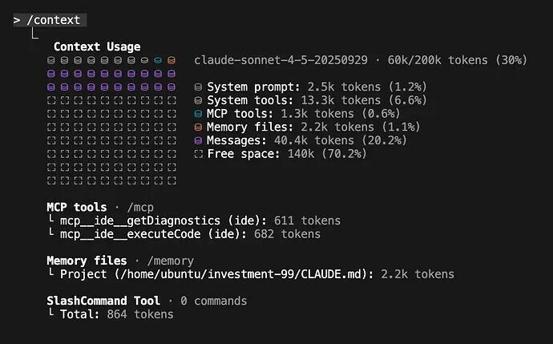

# 《我如何使用 Claude Code 的每个功能》译： How I Use Every Claude Code Feature

> 原文链接: https://mp.weixin.qq.com/s?__biz=MzkzOTIyMjA0Mw==&mid=2247489743&idx=1&sn=3314dc28bb7e55b03f0b1511685d971b&chksm=c337ebcd051d08d5ac6ae3cbf379fb745beeedcd9c233d1e3d7452229d836cd2f2547e670213&mpshare=1&scene=24&srcid=0121mrWesZetpznnYDdujw10&sharer_shareinfo=89aa0c2312825aed7ff35dc4b6fed376&sharer_shareinfo_first=89aa0c2312825aed7ff35dc4b6fed376#rd
> 图片状态: 已本地化 (assets/)

---

## 我如何使用 Claude Code 的每一个功能

内容很多，但希望能对你有用。如果你还没有使用像 Claude Code 或 Codex CLI 这样的基于 CLI 的智能体，你可能应该尝试一下。关于这些高级功能的优秀指南很少，所以唯一的学习方法就是亲身投入。

这是一份关于我使用 Claude Code 所有方式的经验大盘点。

* * *

我经常使用 Claude Code。非常多。

作为一个业余爱好者，我每周都会在虚拟机里跑几次并在副业项目上使用它，通常带着 `--dangerously-skip-permissions` 参数，以此来“随性编程（vibe code）”我脑子里的任何想法。在职业方面，我的团队的一部分工作是为我们的工程团队构建 AI-IDE 规则和工具，而该工程团队仅在代码生成（codegen）上每月就要消耗**数十亿 token** 。

CLI Agent（命令行智能体）领域正变得拥挤，在 Claude Code、Gemini CLI、Cursor 和 Codex CLI 之间，感觉真正的竞争其实是在 Anthropic 和 OpenAI 之间。但这说实话（TBH），当我和其他开发者交谈时，他们的选择通常归结为一些看似表面的东西——一个“幸运的”功能实现，或者一种他们偏好的系统提示词“氛围（vibe）”。在这个阶段，这些工具其实都相当不错。我也觉得大家往往过度关注输出的风格或 UI。比如对我来说，那种“你完全正确！”式的阿谀奉承并不是一个显著的 Bug；它只是一个信号，说明你作为人类介入得太多了。通常我的目标是“发射后不管（shoot and forget）”——即委派任务、设定上下文，然后让它自己工作。评价工具的标准应该是最终的 PR（Pull Request），而不是它如何到达那里的过程。

在坚持使用 Claude Code 几个月后，这篇文章是我对 Claude Code 整个生态系统的反思集锦。我们将涵盖我使用的几乎每一个功能（同样重要的是，我也将涵盖那些我不使用的功能），从基础的 `CLAUDE.md` 文件和自定义斜杠命令，到强大的子智能体（Subagents）、钩子（Hooks）和 GitHub Actions 的世界。**这篇文章有点长，我建议把它当作参考手册，而不是一篇需要通读的文章。**

* * *

###  CLAUDE.md

要在代码库中有效使用 Claude Code，最重要的单个文件就是根目录下的 `CLAUDE.md`。这个文件是智能体的“宪法”，是关于你特定仓库如何运作的主要真理来源。

如何对待这个文件取决于上下文。对于我的业余项目，我让 Claude 随便往里面塞东西。

对于我的职业工作，我们 Monorepo（单一代码库）中的 `CLAUDE.md` 是受到严格维护的，目前大小为 13KB（我很轻易就能预见到它增长到 25KB）。

  * 它只记录被 30%（任意设定的阈值）或更多工程师使用的工具和 API（其他的工具记录在产品或库特定的 markdown 文件中）。
  * 我们甚至开始为每个内部工具的文档分配有效的最大 token 计数，就像向团队出售“广告位”一样。如果你不能简洁地解释你的工具，那它就还没准备好进入 `CLAUDE.md`。

#### 技巧和常见的反模式

随着时间的推移，我们为编写有效的 `CLAUDE.md` 形成了一套强有力的、有主见的哲学。

  1. **从护栏开始，而不是说明书。** 你的 `CLAUDE.md` 应该从小处着手，基于 Claude 经常出错的地方进行记录。
  2. **不要 @ 文件。** 如果你在别处有大量的文档，很容易诱惑你在 `CLAUDE.md` 中 `@-提及` 那些文件。这会因为每次运行都嵌入整个文件而导致上下文窗口膨胀。但如果你只是**提及** 路径，Claude 往往会忽略它。你必须向智能体**推销** 为什么要以及何时阅读该文件。“对于复杂的……用法，或者如果你遇到 `FooBarError`，请参阅 `path/to/docs.md` 以获取高级故障排除步骤。”
  3. **不要只说“从不”。** 避免仅有否定意义的约束，如“从不使用 `--foo-bar` 标志”。当智能体认为它**必须** 使用该标志时，它会卡住。永远要提供一个替代方案。
  4. **将` CLAUDE.md` 作为一种强制机制。** 如果你的 CLI 命令复杂且冗长，不要写大段的文档来解释它们。那是在修补人的问题。相反，写一个简单的 bash 包装器，提供清晰、直观的 API，并记录**那个** 包装器。保持你的 `CLAUDE.md` 尽可能简短，是简化代码库和内部工具的一个极好的强制机制（forcing function）。

这是一个简化的快照：
    
    
    # Monorepo  
      
    ## Python  
    - Always ...  
    - Test with <command>  
    ... 10 more ...  
      
    ## <Internal CLI Tool>  
    ... 10 bullets, focused on the 80% of use cases ...  
    - <usage example>  
    - Always ...  
    - Never <x>, prefer <Y>  
      
    For <complex usage> or <error> see path/to/<tool>_docs.md  
      
    ...  
    

最后，我们将此文件与 `AGENTS.md` 文件保持同步，以保持与我们工程师可能正在使用的其他 AI IDE 的兼容性。

如果您正在寻找更多关于为编码智能体编写 markdown 的技巧，请参阅  _“AI Can’t Read Your Docs”_ 、 _“AI-powered Software Engineering”_ 和  _“How Cursor (AI IDE) Works”_ 。

> **总结：** 将你的 `CLAUDE.md` 视为一套高级的、精心策划的护栏和指针。用它来指导你需要在哪方面投资更 AI（和人类）友好的工具，而不是试图把它变成一本详尽的手册。

* * *

### 紧凑、上下文与清晰 (Compact, Context, & Clear)

我建议在编码过程中至少运行一次 `/context`，以了解你是如何使用那 200k 上下文窗口的（即使是 Sonnet-1M，我也不相信完整的上下文窗口能被有效利用）。对我们来说，Monorepo 中的一个新会话基准成本约为 ~20k token (10%)，剩下的 180k 用于进行更改——这很快就会填满。

 _[图片：我最近的一个副业项目中` /context` 的截图。你几乎可以把它想象成磁盘空间，随着你开发功能而填满。几分钟或几小时后，你需要清除消息（紫色部分）以腾出空间继续。]_

我有三个主要的工作流程：

  1. **/compact (避免使用):** 我尽可能避免使用这个。自动压缩是不透明的、容易出错的，而且优化得不好。
  2. **/clear + /catchup (简单重启):** 我的默认重启方式。我使用 `/clear` 清除状态，然后运行自定义的 `/catchup` 命令，让 Claude 读取我 git 分支中所有已更改的文件。
  3. **“文档化并清除” (复杂重启):** 针对大型任务。我让 Claude 将其计划和进度转储到一个 `.md` 文件中，`/clear` 状态，然后通过告诉它阅读该 `.md` 文件并继续来开始一个新的会话。

> **总结：** 不要信任自动压缩。对于简单的重启使用 `/clear`，对于复杂的任务使用“文档化并清除”方法，以创建持久的外部“记忆”。

* * *

### 自定义斜杠命令 (Custom Slash Commands)

我认为斜杠命令只是常用提示词的简单快捷方式，仅此而已。我的设置极简：

  * `/catchup`: 我刚才提到的命令。它只是提示 Claude 读取我当前 git 分支中所有已更改的文件。
  * `/pr`: 一个简单的助手，用于清理我的代码，暂存它，并准备一个 Pull Request。

依我看（IMHO），如果你有一长串复杂的自定义斜杠命令，你就创造了一种反模式。对我来说，像 Claude 这样的智能体的全部意义就在于，你可以输入**几乎** 任何你想要的东西，并得到一个有用的、可合并的结果。当你强迫工程师（或非工程师）为了完成工作而去学习一个新的、记录在某处的“必备魔法命令列表”的那一刻，你就失败了。

> **总结：** 将斜杠命令用作简单的个人快捷方式，而不是用来替代构建更直观的 `CLAUDE.md` 和更好用的智能体工具。

* * *

### 自定义子智能体 (Custom Subagents)

理论上，自定义子智能体是 Claude Code 最强大的上下文管理功能。卖点很简单：一个复杂的任务需要 **X** token 的输入上下文（例如，如何运行测试），积累 **Y** token 的工作上下文，并产生 **Z** token 的答案。运行 **N** 个任务意味着主窗口中有 **(X + Y + Z) * N** 个 token。

子智能体的解决方案是将 **(X + Y) * N** 的工作分包给专门的智能体，这些智能体只返回最终的 **Z** token 答案，保持主上下文的清洁。

我觉得这是一个强有力的想法，但在实践中，**自定义** 子智能体制造了两个新问题：

  1. **它们阻碍上下文：** 如果我制作一个 `PythonTests` 子智能体，我现在就对**主** 智能体隐藏了所有的测试上下文。它不再能整体地推理一个变更。它现在被迫调用子智能体仅仅为了知道如何验证它自己的代码。
  2. **它们强迫人类工作流：** 更糟糕的是，它们迫使 Claude 进入一个僵化的、人类定义的工作流。我现在在发号施令它必须**如何** 委派，但这恰恰是我试图让智能体为我解决的问题。

我首选的替代方案是使用 Claude 内置的 `Task(...)` 功能来生成**通用** 智能体的克隆。

我将所有的关键上下文放在 `CLAUDE.md` 中。然后，我让**主智能体** 决定何时以及如何将工作委派给它自己的副本。这给了我子智能体节省上下文的所有好处，却没有其缺点。智能体动态地管理自己的编排。

在我的  _“构建多智能体系统（第2部分）”_ 帖子中，我称之为“Master-Clone（主-克隆）”架构，并且我强烈倾向于这种架构，而不是自定义子智能体所鼓励的“Lead-Specialist（领导-专家）”模型。

> **总结：** 自定义子智能体是一个脆弱的解决方案。在 `CLAUDE.md` 中给你的主智能体提供上下文，并让它使用自己的 `Task/Explore(...)` 功能来管理委派。

* * *

### 恢复、继续与历史记录 (Resume, Continue, & History)

在简单的层面上，我经常使用 `claude --resume` 和 `claude --continue`。它们非常适合重启卡住的终端或快速重启旧会话。我经常会 `claude --resume` 几天前的会话，只是为了让智能体总结它是如何克服某个特定错误的，然后我用这些信息来改进我们的 `CLAUDE.md` 和内部工具。

往深了说，Claude Code 将所有会话历史记录存储在 `~/.claude/projects/` 中，以利用原始的历史会话数据。我有脚本对这些日志进行元分析，寻找常见的异常、权限请求和错误模式，以帮助改进面向智能体的上下文。

> **总结：** 使用 `claude --resume` 和 `claude --continue` 来重启会话并挖掘深埋的历史上下文。

* * *

### 钩子 (Hooks)

钩子非常重要。我不用于业余项目，但在复杂的企业仓库中引导 Claude，它们至关重要。它们是确定性的“必须做（must-do）”规则，是对 `CLAUDE.md` 中“应该做（should-do）”建议的补充。

我们使用两种类型：

  1. **提交时拦截 (Block-at-Submit) 钩子：** 这是我们的主要策略。我们有一个 `PreToolUse` 钩子包裹任何 `Bash(git commit)` 命令。它检查是否存在 `/tmp/agent-pre-commit-pass` 文件，我们的测试脚本**只有** 在所有测试通过时才会创建该文件。如果文件丢失，钩子会阻止提交，迫使 Claude 进入“测试-修复”循环，直到构建变绿。
  2. **提示性 (Hint) 钩子：** 这些是简单的非阻塞钩子，如果智能体正在做次优的事情，它提供“发射后不管”的反馈。

我们特意**不** 使用“写入时拦截”钩子（例如，在 `Edit` or `Write` 上）。在计划中期阻止智能体会让它困惑甚至“沮丧”。让它完成工作，然后在提交阶段检查最终完成的结果要有效得多。

> **总结：** 使用钩子在提交时强制执行状态验证（提交时拦截）。避免在写入时拦截——让智能体完成它的计划，然后检查最终结果。

* * *

### 规划模式 (Planning Mode)

对于任何使用 AI IDE 的“大型”功能变更，规划都是必不可少的。

对于我的业余项目，我专门使用内置的规划模式。这是在 Claude 开始之前与之对齐的一种方式，定义**如何** 构建某物以及它需要停下来向我展示其工作的“检查点”。定期使用此功能可以建立一种强烈的直觉，了解需要什么最小的上下文才能获得好的计划，而不会让 Claude 搞砸实现。

在我们工作的 Monorepo 中，我们已经开始推出一个基于 Claude Code SDK 构建的自定义规划工具。它类似于原生规划模式，但使用了大量提示词，使其输出与我们要现有的技术设计格式对齐。它还开箱即用地强制执行我们的内部最佳实践——从代码结构到数据隐私和安全。这让我们的工程师可以“凭感觉规划（vibe plan）”一个新功能，就像他们是高级架构师一样（或者至少那是我们的卖点）。

> **总结：** 对于复杂的变更，始终使用内置的规划模式，在智能体开始工作之前对齐计划。

* * *

### 技能 (Skills)

我同意 **Simon Willison** 的观点：技能（Skills）可能比 MCP 更重要。

如果你一直关注我的帖子，你会知道我已经从大多数开发工作流的 MCP 中疏远了，更倾向于构建简单的 CLI（正如我在  _“AI Can’t Read Your Docs”_ 中所论证的）。我对智能体自主性的心智模型已经演变为三个阶段：

  1. **单一提示词 (Single Prompt):** 在一个巨大的提示词中给智能体所有上下文。（脆弱，无法扩展）。
  2. **工具调用 (Tool Calling):** “经典”智能体模型。我们手工制作工具并为智能体抽象现实。（更好，但创造了新的抽象和上下文瓶颈）。
  3. **脚本化 (Scripting):** 我们给智能体访问原始环境的权限——二进制文件、脚本和文档——它**即时** 编写代码与之交互。

以此模型为念，**Agent Skills（智能体技能）** 显然是下一个功能。它们是“脚本化”层的正式产品化。

如果像我一样，你已经**倾向于 CLI 而不是 MCP** ，那么你其实一直都在隐式地获得技能的好处。`SKILL.md` 文件只是记录这些 CLI 和脚本并将它们暴露给智能体的一种更有条理、可共享和可发现的方式。

> **总结：** 技能是正确的抽象。它们将基于“脚本”的智能体模型形式化，这比 MCP 所代表的僵化的、类 API 的模型更健壮、更灵活。

* * *

### MCP (模型上下文协议)

技能并不意味着 MCP 死了（另请参阅  _“Everything Wrong with MCP”_ ）。以前，许多人构建了糟糕的、上下文沉重的 MCP，包含几十个只是镜像 REST API 的工具（`read_thing_a()`, `read_thing_b()`, `update_thing_c()`）。

“脚本化”模型（现在通过技能形式化）更好，但它需要一种安全的方式来访问环境。对我来说，这就是 MCP 新的、更专注的角色。

MCP 不应该是一个臃肿的 API，而应该是一个简单的、安全的网关，提供几个强大的、高级的工具：

  * `download_raw_data(filters…)`
  * `take_sensitive_gated_action(args…)`
  * `execute_code_in_environment_with_state(code…)`

在这个模型中，MCP 的工作不是为智能体抽象现实；它的工作是管理认证、网络和安全边界，然后别挡道。它为智能体提供**入口点** ，智能体随后使用其脚本和 **markdown** 上下文来做实际工作。

我唯一还在使用的 MCP 是用于 **Playwright** 的，这是合理的——它是一个复杂的、有状态的环境。我所有的无状态工具（如 Jira, AWS, GitHub）都已经迁移到了简单的 CLI。

> **总结：** 使用充当数据网关的 MCP。给智能体一两个高级工具（像原始数据转储 API），让它可以针对这些工具编写脚本。

* * *

### Claude Code SDK

Claude Code 不仅仅是一个交互式 CLI；它也是一个强大的 SDK，用于构建全新的智能体——无论是编码还是非编码任务。我已经开始在大多数新的业余项目中使用它作为我的默认智能体框架，而不是 LangChain/CrewAI 之类的工具。

我主要在三个方面使用它：

  1. **大规模并行脚本:** 对于大规模重构、错误修复或迁移，我不使用交互式聊天。我编写简单的 bash 脚本，并行调用 `claude -p “in /pathA change all refs from foo to bar”`。比起试图让主智能体管理几十个子智能体任务，这更具可扩展性和可控性。
  2. **构建内部聊天工具:** 该 SDK 非常适合将复杂的流程包装在简单的聊天界面中，供非技术用户使用。比如一个安装程序，如果出错，回退到 Claude Code SDK 仅仅为用户**修复** 问题。或者一个内部的“v0-at-home”工具，让我们的设计团队在我们的内部 UI 框架中“凭感觉写代码”生成模拟前端，确保他们的想法是高保真的，并且代码在前端生产代码中更直接可用。
  3. **快速智能体原型设计:** 这是我最常用的用途。它不仅仅用于编码。如果我对任何智能体任务有一个想法（例如，一个使用自定义 CLI 或 MCP 的“威胁调查智能体”），我会使用 Claude Code SDK 在提交完整的、已部署的脚手架之前快速构建和测试原型。

> **总结：** Claude Code SDK 是一个强大的、通用的智能体框架。在你伸手去拿更复杂的框架**之前** ，用它来批处理代码、构建内部工具和快速制作新智能体的原型。

* * *

### Claude Code GHA (GitHub Actions)

Claude Code GitHub Action (GHA) 可能是最受我喜爱但也最被低估的功能之一。它的概念很简单：就是在 GHA 中运行 Claude Code。但这正是这种简单性使其如此强大。

它类似于 **Cursor 的后台智能体** 或 Codex 托管的 Web UI，但可定制性要强得多。你控制整个容器和环境，这为你提供了更多的数据访问权限，而且至关重要的是，比任何其他产品都更强的沙盒和审计控制。此外，它支持像 Hooks 和 MCP 这样的所有高级功能。

我们用它来构建自定义的“PR-from-anywhere（从任何地方提 PR）”工具。用户可以从 Slack、Jira 甚至 CloudWatch 警报触发 PR，GHA 将修复错误或添加功能并返回一个经过全面测试的 PR。

由于 GHA 日志是完整的智能体日志，我们有一个运维流程，定期在公司层面审查这些日志，查找常见的错误、bash 错误或未对齐的工程实践。这创造了一个数据驱动的飞轮：Bug -> 改进 CLAUDE.md / CLI -> 更好的智能体。

`$ query-claude-gha-logs --since 5d | claude -p “看看其他 claude 卡在什么地方并修复它，然后提交一个 PR“`

> **总结：** GHA 是将 Claude Code 投入运营的终极方式。它将其从个人工具转变为工程系统中核心的、可审计的、自我改进的一部分。

* * *

### settings.json

最后，我有几个特定的 `settings.json` 配置，我发现它们对于业余和职业工作都是必不可少的。

  * **HTTPS_PROXY/HTTP_PROXY:** 这对于调试非常有用。我会用它来检查原始流量，确切地看到 Claude 发送了什么提示词。对于后台智能体，这也是进行细粒度网络沙盒化的强大工具。
  * **MCP_TOOL_TIMEOUT/BASH_MAX_TIMEOUT_MS:** 我调高了这些值。我喜欢运行长而复杂的命令，默认的超时时间通常太保守了。老实说我不确定现在有了 bash 后台任务这是否还需要，但我保留它以防万一。
  * **ANTHROPIC_API_KEY:** 在工作中，我们使用企业 API 密钥（通过 apiKeyHelper）。这使我们将计费模式从“按席位”许可证转变为“基于使用量”的定价，这更符合我们的工作方式。
    * 它考虑了开发者使用量的**巨大** 差异（我们在工程师之间见过 1:100 倍的差异）。
    * 它允许工程师在我们的单一企业账户下摆弄非 Claude-Code 的 LLM 脚本。
  * **“permissions”:** 我偶尔会自行审计我允许 Claude 自动运行的命令列表。

> **总结：** 你的 `settings.json` 是高级定制的强大场所。

* * *

  
原文：https://blog.sshh.io/p/how-i-use-every-claude-code-feature
