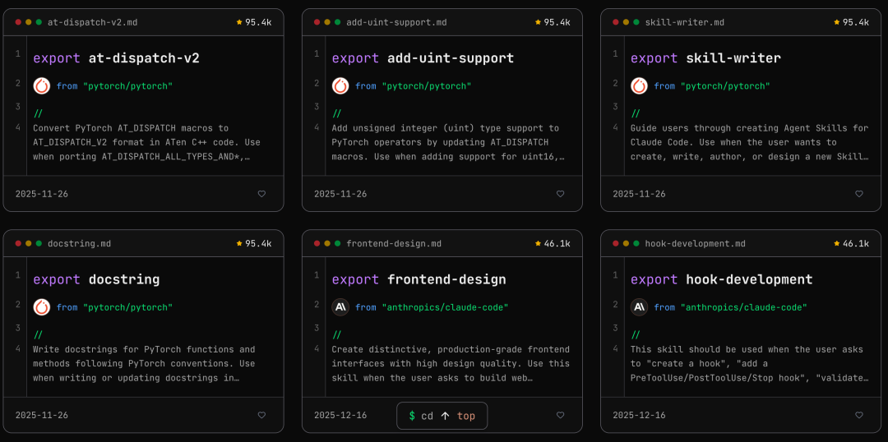
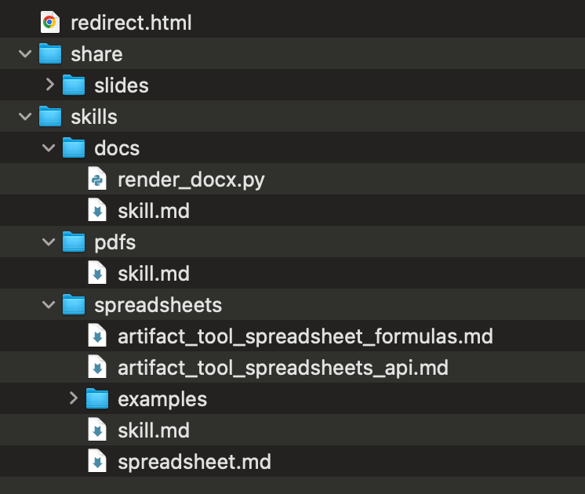

# 别再问“怎么写 SKILL.md”了，直接抄生产级的Skills 库

> 原文链接: https://mp.weixin.qq.com/s?__biz=MzIxNTUxNDA5NQ==&mid=2247485982&idx=1&sn=9eecf80422a4671e4ee37f72c714c9df&chksm=96f4cab0cb4a7485c2ba9074e81ad6eafbb6a65d25bff8031b4b02e0d0a1da2dc5169362011e&mpshare=1&scene=24&srcid=0119grAOYxaOaSUsqQvOLGhr&sharer_shareinfo=4371360a84f56a3a74a76c0718da92ab&sharer_shareinfo_first=4371360a84f56a3a74a76c0718da92ab#rd
> 图片状态: 已本地化 (assets/)

---

> 量变引起质变。最好最快的学习方式就是模仿。

Skills 的热度不减，ChatGPT 和 CodeX 现在也都支持了 SKILL.md。估计很快，Skill 就会像 MCP 一样，获得各个大模型的“内置支持”，成为 Agent 能力的一部分。

关于 Skill 的介绍，已经有很多文章了，我之前也写过两篇。这次主要是分享 十几个自己收集的优质 Skills 资源库，涵盖文档处理、开发工具、创意设计等全场景应用。目的就是偷师学艺。

Claude 官方是有个插件市场的，官方的 Plugin、Skills、SubAgent 等都可以通过插件市场的形式安装，但是内容比较少，不够吃啊。

## Skills 聚合网站

现在大家都细化可视化，那就首推几个 Skills 的可搜索网站，内容多、更新快、有分类：

  * https://skillsmp.com/
  * https://www.aitmpl.com/skills
  * https://claudemarketplaces.com/

|   
---|---  
  
## 开源仓库

这里有各种各样形形色色的 Skill，也是上面的网站的源泉，可以直接追踪仓库的更新记录，学习他们的迭代。

### 1\. 官方出品

#### anthropics/skills

地址：  
https://github.com/anthropics/skills

这是 Anthropic 官方维护的 Skills 示例库，也是学习 Skills 开发的最佳教材。

**核心亮点:**

  * **文档处理四大件** \- Word/PDF/PPT/Excel 完整支持,包括创建、编辑、分析等高级功能
  * **开发者工具** \- MCP 服务器构建、Web 应用测试、Artifacts 创建
  * **创意设计** \- 算法艺术生成、Canvas 设计、主题工厂

特别值得一提的是，官方将 Claude.ai 中**文档创建功能背后的真实 Skills** 开源了！这些都是经过生产环境验证的高质量实现，非常适合作为参考。

具体的安装，可以使用官方的应用市场安装，也可以直接到 Github 仓库里下载。
    
    
    /plugin marketplace add anthropics/skills  
    /plugin install document-skills@anthropic-agent-skills  
    

#### ChatGPT/Skills

地址：  
https://github.com/eliasjudin/oai-skills

X 上疯传的 `/home/oai` 打包，其实恰好暴露了一个趋势：**只要产品有“可读写文件系统 + 可执行环境”，Skills 这种机制就几乎是必然会出现的“prompt 工程化形态”** 。OpenAI 的 Skills 支持同时出现在 ChatGPT（容器环境里有 `/home/oai/skills`）和开源 Codex CLI 里。

|   
---|---  
  
### 2\. 民间开源

这里收集的是 Github 上的 500+ 的 star 量的仓库，算是最优质的资源了，当然会有部分仓库是有重叠的，可以参考学习和使用。

  1. https://github.com/obra/superpowers/tree/main/skills

  2. https://github.com/ComposioHQ/awesome-claude-skills

  3. https://github.com/BehiSecc/awesome-claude-skills

  4. https://github.com/VoltAgent/awesome-claude-skills

  5. https://github.com/travisvn/awesome-claude-skills

  6. https://github.com/mrgoonie/claudekit-skills/tree/main/.claude/skills

  7. https://github.com/K-Dense-AI/claude-scientific-skills

  8. https://github.com/bear2u/my-skills/tree/master/skills

  9. https://github.com/czlonkowski/n8n-skills

  10. https://github.com/huggingface/skills

  11. https://github.com/yusufkaraaslan/Skill_Seekers

这些仓库主要分**九大分类体系:**

  * 文档处理 - EPUB 转换、Markdown 处理
  * 开发工具 - AWS CDK、D3.js 可视化、iOS 模拟器
  * 数据分析 - CSV 智能分析、根因追溯
  * 商业营销 - 竞品广告分析、域名创意生成
  * 沟通写作 - 会议洞察分析、内容研究助手
  * 创意媒体 - 视频下载、GIF 创建
  * 效率组织 - 发票整理、文件智能归档
  * 协作管理 - Git 自动化、代码审查
  * 安全系统 - 威胁猎杀、数字取证

#### 如何选择

  * **开发者:** anthropics/skills + obra/superpowers
  * **内容创作者:** ComposioHQ(Content Research Writer、Theme Factory)
  * **数据分析师:** ComposioHQ(CSV Data Summarizer、Meeting Insights)
  * **设计师:** anthropics/skills(Canvas Design、Brand Guidelines)

## 如何写

推荐先安装官方的 skill-creator 的元 Skill：  
https://github.com/anthropics/skills/tree/main/skills/skill-creator。

然后在会话中，告诉 AI 自己要创建一个什么样的 Skill，它会自自动调用skill-creator 来和你一起创建一个初稿出来。

但是，但是，不要把初稿当成终稿，要自己多调试、测试使用效果，把效果再反馈给 AI，让他帮忙迭代优化 Skill。

当然，开源的、别人的 Skill 自己使用也是一样的方式，不是说拿来就用的，要进行自己的验证和调整，毕竟每个人、每个人业务、每个场景关注的点和侧重是不一样的，没有说“百搭的”。

> 人机合一，质量和输出是我们始终要自己把控的，否则那只是平均概率下的普通效果。

  

