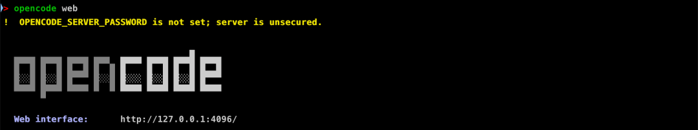
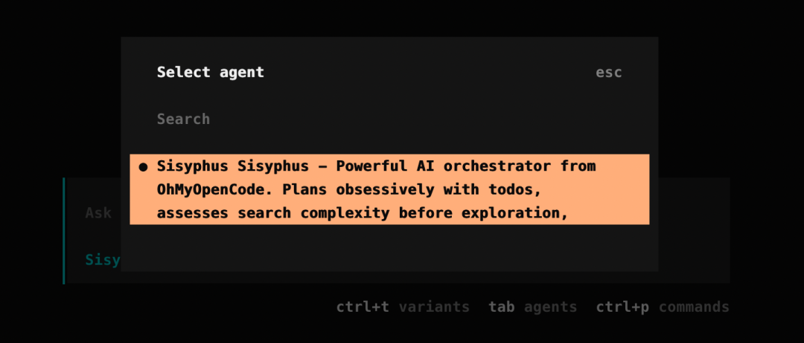

# 开源版 Claude Code 杀疯了，怒斩 70k+ Star！！

> 原文链接: https://mp.weixin.qq.com/s?__biz=MzU0OTc0NzAxMg==&mid=2247487029&idx=1&sn=8182ed847ac4380728d7435545e0a6f2&chksm=faeac4a0237a752ba70e3695156469bbc154aa1ab6363d65501c416d3daad996c411042c3b30&mpshare=1&scene=24&srcid=0119awZr7bjfqOVJ1CfXdBZX&sharer_shareinfo=28d764a7b1284d04fb6910bd64558016&sharer_shareinfo_first=28d764a7b1284d04fb6910bd64558016#rd
> 图片状态: 已本地化 (assets/)

---

_关注公众号，_** _AI_** _技术干货及时送达_ _↓_ 推荐阅读：[玩转 Antigravity 的 16 个实用小技巧](<https://mp.weixin.qq.com/s?__biz=MzU0OTc0NzAxMg==&mid=2247486909&idx=1&sn=ca1f828a3ba7d429277e6763c6de89c4&scene=21#wechat_redirect>)

大家好，我是R哥。

前段时间分享了《[2026 AI编程终极套装：Claude Code + Codex + Gemini CLI + Antigravity，四位一体实战指南！！](<https://mp.weixin.qq.com/s?__biz=MzU0OTc0NzAxMg==&mid=2247486974&idx=1&sn=b4271b118a47561c6b716d8618407363&scene=21#wechat_redirect>)》，还没来得及学习？

别急，2026 年 AI 编程工具又要变天了。。

最近一款号称开源版 Claude Code 的 AI 编程工具杀疯了，它就是 **OpenCode** ，目前它在 Github 的开源项目已经狂飙至 **70k+** Stars 了，太牛逼了。

> 开源地址：https://github.com/anomalyco/opencode

在现在各大 AI 编程工具层出不穷，不乏实力顶尖的选手，比如：**Claude Code、CodeX、Antigravity** 等等，**那 opencode 它到底有什么牛逼的？**

**那么问题来了，这到底跟 Claude Code 有啥不一样啊？**

OpenCode 功能上看起来和 Claude Code 非常相似，不过有几个关键区别：

  * **OpenCode 是 100% 开源的** ，个人使用没有看到有收费项目，不过企业定制文案是收费的；
  * **不绑定任何特定 AI 服务商** ，它能和 Claude、OpenAI、Google 甚至本地模型一起用；
  * 开箱即用的 **LSP** 支持；
  * 专注终端界面（TUI）体验，OpenCode 把终端里的编程体验做到了极限；
  * 使用了**客户端/服务器** 架构，客户端多样性，比如，你能让 OpenCode 在你的电脑上运行，又能通过手机 App 远程操控它。

为什么号称开源版 Claude Code，**正是因为 OpenCode 不绑定任何特定 AI 服务商** ，集各大顶尖模型于一身，想用谁就用谁，非常方便。

## 安装 OpenCode

OpenCode 分为「**命令行** 」版本、「**客户端** 」版本和「网页端」版本。

### 命令行版本

使用以下命令安装即可：
    
    
    # YOLO  
    curl -fsSL https://opencode.ai/install | bash  
      
    # Package managers  
    npm i -g opencode-ai@latest        # or bun/pnpm/yarn  
    scoop install opencode             # Windows  
    choco install opencode             # Windows  
    brew install anomalyco/tap/opencode # macOS and Linux (recommended, always up to date)  
    brew install opencode              # macOS and Linux (official brew formula, updated less)  
    paru -S opencode-bin               # Arch Linux  
    mise use -g opencode               # Any OS  
    nix run nixpkgs#opencode           # or github:anomalyco/opencode for latest dev branch  
    

安装完后在命令行使用 `opencode` 命令：

这个命令行的使用方法，感觉和 Claude Code 和 CodeX CLI 就没有什么区别了。

没用过的可以先看看这两篇：

  * [玩转 Claude Code 的 23 个实用小技巧，效率拉满！！](<https://mp.weixin.qq.com/s?__biz=MzU0OTc0NzAxMg==&mid=2247485524&idx=1&sn=dfabb331208e1b3cef651ec766c9f618&scene=21#wechat_redirect>)
  * [玩转 CodeX CLI 的 16 个实用小技巧，效率拉满！！](<https://mp.weixin.qq.com/s?__biz=MzU0OTc0NzAxMg==&mid=2247485761&idx=1&sn=ec9520c75cfee3d81b5e75f289ad8ced&scene=21#wechat_redirect>)

### 客户端版本

客户端版本下载地址：

> https://github.com/anomalyco/opencode/releases

OpenCode 支持 **macOS、Windows、Linux** 操作系统，大家按需下载安装。

操作系统| 下载包  
---|---  
macOS (Apple Silicon)| `opencode-desktop-darwin-aarch64.dmg`  
macOS (Intel)| `opencode-desktop-darwin-x64.dmg`  
Windows| `opencode-desktop-windows-x64.exe`  
Linux| `.deb, `.rpm`, 或者 AppImage`  
  
安装完成后进入 OpenCode：

### 网页端版本

OpenCode 还支持 Web 网页端使用，在安装好命令行版本后，使用 `opencode web` 命令就能启用网页版本：

它会在本地启用了一个 `4096` 端口，访问 `http://127.0.0.1:4096/` 地址即可：

这样我们就只需要映射一个域名到本地端口，就能实现在外面连接家里的 `opencode` 编程了。

## 支持的模型

OpenCode 支持 **75 多个 LLM 提供商** ，并且支持运行本地模型，其中还包括几个免费的大模型，真香。

### 免费模型

在命令行中使用 `/models` 命令可以选择要使用的模型：

有 `Free` 标识的就是可以免费使用的模型，这也是 OpenCode 能火的原因之一吧。

### 连接其他主流大模型

使用 OpenCode，可以通过 `/connect` 命令配合 API 密钥来使用任何 LLM 提供商。

OpenCode 除了使用 API Key 连接其他主流大模型，它还支持所有主流服务商的订阅计划，可以使用 Claude Pro/Max、ChatGPT Plus/Pro 或 GitHub Copilot 等订阅计划，连上它们就能使用了。

比如，在这里我还可以连接 Google Antigravity：

认证成功后就可以使用 Google Gemini 相关模型了：

Antigravity 使用教程：

> [再见 Cursor！玩转 Antigravity 的 16 个实用小技巧，让 AI 真正帮你干活！！](<https://mp.weixin.qq.com/s?__biz=MzU0OTc0NzAxMg==&mid=2247486909&idx=1&sn=ca1f828a3ba7d429277e6763c6de89c4&scene=21#wechat_redirect>)

## 基本用法

### 项目初始化

进入命令行或者客户端中，运行 `/init` 命令，就可以初始化项目的 OpenCode 配置，它会在项目根目录下初始化一个 `AGENTS.md` 文件。

这个文件可以提交到 Git，这有助于 OpenCode 了解项目结构和所使用的编码模式。

### 快捷键

使用 `/` 使用使用快捷命令：

使用 `@` 引用上下文内容：

### 使用内置 Agents

OpenCode 内置了两个 Agents：

  * **build（构建）** ：默认模式，**完全授权** 的代理开发模式；
  * **plan（计划）** ： 用于**分析和代码探索** 的只读代理，**默认情况下禁止文件编辑** ，运行 Bash 命令前会先征求许可，特别适合用来探索不熟悉的代码库，或者规划代码改动。

在命令行版本中，你可以用 `Tab` 键进行切换，在客户端版本中在输入框左下角进行切换。

比如，你开发一个新功能时，你可以使用 `plan` 模型给你出实现方案，如果对方案感到满意后，再次按 Tab 键切换回 `build` 模式让它实现那个文案即可。

另外，OpenCode 还内置了一个用于**复杂搜索和多步骤任务** 的通用子代理，这个功能在内部使用，可以通过在消息中使用 `@general` 来调用。

### 回滚代码

在 OpenCode 中回滚代码非常简单，使用 `/undo` 命令即可：

回滚成功后还可以使用 `/redo` 命令进行重做：

## Oh My OpenCode

同时火爆的还有 `oh-my-opencode` 插件，目前已经快 **20k** 的 Star 了：

> 开源地址：https://github.com/code-yeongyu/oh-my-opencode

这命名，感觉在致敬 Linux 界的传奇 “**Oh My Zsh** ”，同时它也叫 **Sisyphus** ，它是一个开箱即用、能像你一样写代码的智能助手。

Oh My OpenCode 插件的核心理念是多代理协作，除了主代理之外，它还引入了一系列专业代理，比如以下几个精选代理：

  * **Oracle** ：设计、调试；
  * **Frontend UI/UX Enginee** r：前端开发；
  * **Librarian** ：官方文档、开源实现、代码库探索；
  * **Explore** ：超快的代码库探索（上下文搜索）。

Oh My OpenCode 支持同时调用多个代理，比如，它能自动搜索官方文档、你整个代码库的历史记录，它还内置了 LSP 工具，派给 LLMs 时，再也不用担心上下文管理了。

作者说，他为了个人开发，光是用 LLMs 就花了大约 **24000** 个 token，各种工具都试了个遍，折腾得死去活来，**最后还是 OpenCode 赢了** 。

他还说，他遇到的每个问题，答案全都在这个插件里了，如果说 OpenCode 是 Debian/Arch，那 Oh My OpenCode 就是 Ubuntu/Omarchy。

安装方法：

提前安装好 bun：

> curl -fsSL https://bun.sh/install | bash

然后再安装 oh-my-opencode：

> npx oh-my-opencode install
> 
> 或者使用：
> 
> bunx oh-my-opencode install

安装完成后，按说明完成各服务商的认证：

> ⚠️ **注意** ：
> 
> 截至 2026 年 1 月，Anthropic 已因违反服务条款（ToS）而限制了第三方 OAuth 访问，所以，目前 Claude Code 的订阅是不能用了。

按照提示按需配置你订阅的 Claude、ChatGPT 和 Gemini 计划即可，没有就选择 No。

安装完成，现在就可以使用 Oh My OpenCode 插件了。

重新启动 OpenCode，使用 `/agent` 命令来切换 Agent：

完后，我来问它：

> 你是什么模型

## 结语

整体看下来，OpenCode 能在短时间内爆火到 70k+ Star，真不是运气好，而是**刚好踩中了当下 AI 编程工具的所有痛点** 。

一边是 Claude Code、CodeX 这些强但封闭、绑定生态的工具，另一边是大量能力不错却体验割裂的开源方案，而 OpenCode 恰好站在了中间：**完全开源、不绑定模型、终端体验拉满、还能多端远程协作** 。

它最大的价值，不是又一个 AI 写代码的工具，而是把 **模型选择权、使用场景、交互方式** 全部还给了开发者，你想白嫖免费模型可以，想接 Claude、ChatGPT、Gemini 也行，甚至跑本地模型都没问题，这种自由度在同类工具里非常少见。

再加上 Oh My OpenCode 这种外挂级插件，把多代理、文档搜索、代码探索、LSP 一股脑塞进来，基本已经是**个人开发者和独立黑客的理想形态** 了。

可以说，如果你平时就喜欢在终端里干活，又对模型绑定、订阅限制很不爽，那 OpenCode 基本就是冲着你来的。

所以，OpenCode 不是要干掉 Claude Code，而是让你不再只剩 Claude Code 一个选择。

未完待续，接下来会继续分享更多 AI 编程的心得体验、高级使用技巧，公众号持续分享 AI 实战干货，关注「**AI技术宅** 」公众号和我一起学 AI。

**AI 不会淘汰程序员，但不会用 AI 的除外，会用 AI 的程序员才有未来！**

> **版权声明：** 本文系公众号 "AI技术宅" 原创，转载、引用本文内容请注明出处，抄袭、洗稿一律投诉侵权，后果自负，并保留追究其法律责任的权利。

< END >

推荐阅读：

[玩转 Antigravity 的 16 个实用小技巧！！](<https://mp.weixin.qq.com/s?__biz=MzU0OTc0NzAxMg==&mid=2247486909&idx=1&sn=ca1f828a3ba7d429277e6763c6de89c4&scene=21#wechat_redirect>)  

[Google 推出 AI 编程工具：Antigravity！](<https://mp.weixin.qq.com/s?__biz=MzU0OTc0NzAxMg==&mid=2247485982&idx=1&sn=50c9cfa6b3d650afb4670351b1eb9516&scene=21#wechat_redirect>)！

[Gemini CLI 免费用户也能使用 Gemini 3 了！](<https://mp.weixin.qq.com/s?__biz=MzU0OTc0NzAxMg==&mid=2247486931&idx=1&sn=03174cf443f2a0990e95a1ddf6cff61b&scene=21#wechat_redirect>)  

[免费领 Gemini 3 Pro 会员 1 年（亲测可用！）](<https://mp.weixin.qq.com/s?__biz=MzU0OTc0NzAxMg==&mid=2247486119&idx=1&sn=a7d8990f37c4afe4da21aaf4fb223c6a&scene=21#wechat_redirect>)

[免费白嫖 Gemini 3 Pro 的 3 种方式，太香了！](<https://mp.weixin.qq.com/s?__biz=MzU0OTc0NzAxMg==&mid=2247486093&idx=1&sn=6d2d4a67110330719672fefe73fd1d4d&scene=21#wechat_redirect>)

[Gemini 3 Pro 的 8 个官方入口（建议收藏）](<https://mp.weixin.qq.com/s?__biz=MzU0OTc0NzAxMg==&mid=2247486016&idx=1&sn=0625a887ce4f4f8bbb0db1dbc01b812d&scene=21#wechat_redirect>)

[Claude Code 又推出了 Skills，保姆级教程！](<https://mp.weixin.qq.com/s?__biz=MzU0OTc0NzAxMg==&mid=2247485897&idx=1&sn=1ed3e39cc171c3bca79f96d2d12c0f7d&scene=21#wechat_redirect>)

[玩转 CodeX CLI 的 16 个实用小技巧！](<https://mp.weixin.qq.com/s?__biz=MzU0OTc0NzAxMg==&mid=2247485761&idx=1&sn=ec9520c75cfee3d81b5e75f289ad8ced&scene=21#wechat_redirect>)

[再见 Claude Code，我选择了 Codex！](<https://mp.weixin.qq.com/s?__biz=MzU0OTc0NzAxMg==&mid=2247485708&idx=1&sn=441185cac6b1a3f3cad547579de6a334&scene=21#wechat_redirect>)

[玩转 Claude Code 的 23 个实用小技巧！](<https://mp.weixin.qq.com/s?__biz=MzU0OTc0NzAxMg==&mid=2247485524&idx=1&sn=dfabb331208e1b3cef651ec766c9f618&scene=21#wechat_redirect>)

更多 ↓↓↓ 关注公众号 ✔ 标星⭐ 哦
