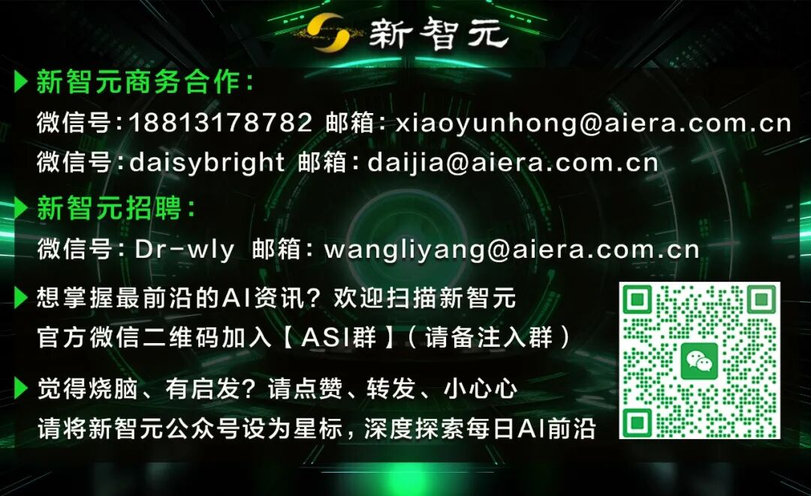

# 开源版Cowork爆火，逼得Anthropic下放Cowork

> 原文链接: https://mp.weixin.qq.com/s?__biz=MzI3MTA0MTk1MA==&mid=2652665594&idx=1&sn=bf879f0aa3ea5c3233a66f8681cea8cb&chksm=f0bbee1a087f233782ebbeaba4c552803649b31c39d2f90f5cc59e81d8ea166195d561374641&mpshare=1&scene=24&srcid=0119JZswXB3GNhnZYnRvL0Fn&sharer_shareinfo=92ea7bbf6745ec81c8b4bc6426e9383b&sharer_shareinfo_first=fbf909d033a02f87a0c3806af67f9136#rd
> 图片状态: 已本地化 (assets/)

---

### 

### 

* * *

  

******新智元报道**

编辑：艾伦

##### **【新智元导读】 仅用两天开发出的开源项目 Openwork，如何逼迫 AI 巨头 Anthropic 低头？面对免费、更快、更安全的开源竞品，Anthropic 紧急将原本 $100 订阅独享的 Cowork 功能下放至 $20 档位。这场「官方逼死同人」的反向剧本，揭示了 AI 智能体时代的定价权，正在从巨头手中滑落。**

2026年1月，硅谷发生了一场没有硝烟的定价权战争。

战场的两端，一方是估值 1830 亿美元、拥有顶尖算力的 AI 巨头 Anthropic，另一方是 GitHub 上一个名为 Openwork 的开源项目，由几名开发者在两天黑客松（编程马拉松，Hackathon）中拼凑而成。

结果出人意料：巨头退让了。

就在 Openwork 上线并宣布「免费、开源、本地运行」后不久，Anthropic 悄然更新了定价策略。

原本仅供每月 100 美元 Max 订阅用户享用的核心功能——Claude Cowork，正式向每月 20 美元的 Pro 用户开放。

https://support.claude.com/en/articles/13345190-getting-started-with-cowork

这很可能并非只是巧合，而是一次精准的防御性降价。

在开源社区用代码填平技术护城河的瞬间，商业公司维持高溢价的理由崩塌了。

**极客的愤怒****与 80 美元的差价**

故事始于一个朴素的动机：嫌贵。

开发者 Karan Vaidya 想用 Claude Cowork 处理繁琐的桌面任务，但每月 100 美元的门槛让他迟疑。

既然买不起，那就造一个。

他和队友利用 Composio 工具路由和 Claude Code，在 48 小时内构建了一个替代品。

这就是 Openwork。

它不仅仅是一个免费的「平替」，在某些核心维度上，它甚至完成了对官方产品的超越。

Openwork 是一个运行在用户本地机器上的桌面智能体。

它没有复杂的订阅陷阱，奉行「自带干粮」（Bring Your Own Key）原则。

用户填入自己的 OpenAI、Anthropic 或谷歌 API 密钥，即可驱动它工作。

如果你拥有一块高性能显卡，甚至可以通过 Ollama 调用本地模型，实现真正的零成本运行。

它的核心逻辑粗暴而有效：剥离中间商。

官方 Cowork 的溢价在于它打包了算力与服务。

Openwork 则将这层包装撕开，提供一个开源的图形界面的壳，让用户直接与底层模型对话。

Or Hiltch，Openwork 的另一位核心开发者，列出了一组让 Anthropic 尴尬的数据：得益于 Sawyer Hood 开发的 `dev-browser`，Openwork 在执行任务时的速度是官方 Claude for Chrome 的 4 倍。

更致命的是隐私。

Openwork 运行在本地，用户决定它能访问哪个文件夹。

它不依赖主浏览器实例，极大降低了提示词注入导致主账号数据泄露的风险。

免费、更快、更安全。这三个词组合在一起，就是对收费产品的宣判书。

**Cowork：从神坛跌落凡间**

为了理解这次降价的被迫性，需要厘清 Cowork 对 Anthropic 的战略意义。

Cowork 最初是 Claude Code 的泛化版本。

Anthropic 发现，程序员不仅用 Claude Code 写代码，还用它整理文件、抓取网页、生成报表。

于是官方顺水推舟，推出了面向非技术人员的 Cowork。

以前你问 AI：「怎么整理这些发票？」它会给你列个步骤一二三。

Cowork 的逻辑是：「把这些发票整理好。」

然后它会自己扫描文件夹，识别文件名，提取金额，创建一个 Excel，填入数据，最后发给你确认。

它在行动，而非单纯对话。

这种「甚至不需要你动脑子」的能力，曾是 Anthropic 划分用户阶层的金线。

Max 用户付出的 100 美元，是「数字员工」的工资。

Openwork 的出现，让这笔工资显得滑稽。

既然开源代码能让用户零成本拥有一个「数字员工」，Anthropic 就无法再以稀缺性为由索要高价。

**只有降低门槛****才能保住入口**

Anthropic 的反应迅速且决绝。

将 Cowork 下放给 20 美元的 Pro 用户，看似损失了 Max 用户的溢价，实则是为了保住更珍贵的资产：桌面入口。

如果任由 Openwork 发展，极客和开发者会迅速倒向开源生态。在 Openwork 的框架下，Anthropic 只是众多模型供应商中的一个选项。

用户今天可以用 Claude，明天就可以换成 GPT-5 或者 DeepSeek。这种「管道化」的危机，是任何平台型公司都无法接受的。

20 美元是一个精妙的定价。

它击穿了普通用户的心理防线。

对于大多数非技术人员，去 GitHub 下载源码、配置环境、申请 API Key 依然是一件麻烦事。

Anthropic 赌的是，为了省去这些折腾，用户愿意支付 20 美元买一个「开箱即用」的官方服务。

这是一场用「便利性」对抗「自由度」的博弈。

**技术平权的加速**

2026 年初的这一幕，可能将作为 AI 落地史上的经典案例被反复提及。

它证明了在智能体时代，应用层的护城河比想象中更浅。

只要底层模型的 API 是开放的，任何昂贵的闭源应用，都会在极短时间内迎来开源社区的降维打击。

Openwork 就像一条鲶鱼，搅动了原本沉闷的定价体系。

它不仅迫使巨头低头，更加速了 AI 智能体从「高科技展示品」向「日用工具」的转化。

对于用户而言，无论选择开源的 Openwork 还是降价后的 Cowork，都是赢家。

当技术试图通过高价自我神化时，代码总会找到回归大众的路径。

参考资料：  
https://www.accomplish.ai/openwork/  
**秒追ASI****⭐点赞、转发、在看一键三连⭐****点亮星标，锁定新智元极速推送！****  
**

