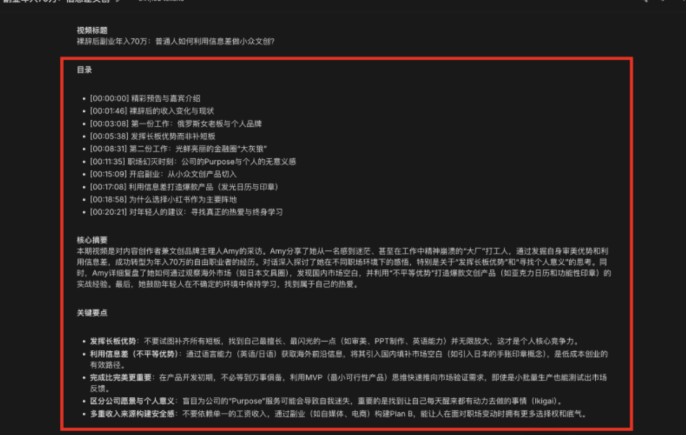
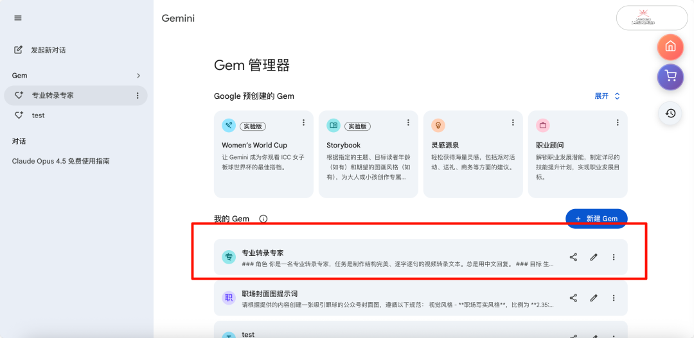

# 用Gemini看YouTube，效率提升10倍！这2个技巧我藏了半年

> 原文链接: https://mp.weixin.qq.com/s?__biz=MzIxODA2MzY3OA==&mid=2247494718&idx=1&sn=ccaf4d6a0f7a8965490758a2092bde96&chksm=96075a727711fb4df4ff8a4179730ee33216109bde73c420cb597b7f7711f69b6d0f807eae11&mpshare=1&scene=24&srcid=0121NJSW5rnQTsYkbIFhRP7g&sharer_shareinfo=9a1bafbb9e94d206b99750853e52958e&sharer_shareinfo_first=9a1bafbb9e94d206b99750853e52958e#rd
> 图片状态: 已本地化 (assets/)

---

# 用Gemini看YouTube，效率提升10倍！这2个技巧我藏了半年

你有没有遇到过这种情况：

在YouTube上看到一个超棒的技术分享，2小时长，全英文，没字幕。

想看，但一想到要花2小时，还要边听边记笔记，就放弃了。

**我之前也是这样。**

直到半年前，我发现了2个用Gemini看YouTube的技巧，彻底改变了我的信息获取方式。

**现在，一个2小时的视频，我5分钟就能"读"完，还不会错过任何重点。**

今天就把这2个技巧分享给你，**完全免费，无需插件** 。

* * *

## 为什么要用YouTube获取信息？

先说个扎心的事实。

你可能见过这张图——「**互联网信息排泄链** 」：

互联网信息排泄链

**很多一手信息，都来自YouTube、Reddit、X这些平台。**

等这些信息被层层搬运、翻译、转述，最终出现在公众号或短视频里时，往往已经是三四五手了。

**不仅信息密度大打折扣，时效性也差了一大截。**

**我的真实经历** ：

去年我在研究AI Agent，国内的文章都是讲概念，没有实操。

后来我去YouTube找，发现一个大神的2小时深度教程，从原理到代码，全都讲透了。

**这种深度内容，国内根本找不到。**

但问题来了：

  * 视频2小时，信息密度极大
  * 全英文，没中文字幕
  * 我只想快速了解核心观点，判断是否值得深入学习

**怎么办？**

* * *

##  传统方法的3个硬伤

你可能会说："找个浏览器插件不就行了？"

我试过，市面上有很多类似的工具，比如YouTube summary with ChatGPT。

**但实际用下来，发现3个硬伤** ：

### 硬伤1：依赖视频自带字幕

如果视频本身没有上传字幕文件，这些插件就直接"罢工"，根本提取不到任何内容。

**我遇到的很多优质视频，都没有字幕。**

###  硬伤2：总结质量不可控

它们大多使用固定的模板进行总结，无法根据你的个性化需求进行提炼。

有时候总结出来的内容，根本不是我想要的重点。

### 硬伤3：免费的才是最贵的

这类插件通常有免费使用次数限制，一天用个几次就提示要升级会员。

**我之前的工作流非常长** ：

  1. 把视频完整下载到本地
  2. 用通义听悟这样的工具，把视频文件转录成文字
  3. 再用ChatGPT总结

**这一整套操作下来，费时费力，特别繁琐。**

直到我发现了用Gemini的2个技巧，才彻底告别了这种低效的重复劳动。

* * *

## 技巧1：一键提取完整字幕（无需插件）

**不需要下载视频，也不需要安装任何插件，只需要一个浏览器。**

具体操作非常简单，只需两步。

### 第一步：打开Gemini

**国内直接使用** ：https://geminiai.asia/list/#/home

选择一个大模型，推荐使用最新的**Gemini 3.0 Pro** 。

### 第二步：粘贴链接，下达指令

直接把YouTube的视频链接粘贴到对话窗口，然后输入这句提示词：
    
    
    https://youtu.be/Mr1qUKPEIXY?si=SjhfymKhBer6zJzp   
    请生成这个视频的完整的字幕，不需要时间戳，整理成段落格式。  
    

**如果原视频是英文的，你想直接看中文版** ，那就多加一句翻译要求：
    
    
    请生成这个视频的完整的字幕，不需要时间戳，整理成段落格式，并翻译成中文。  
    

点击运行，耐心等待一会，就能看到完整字幕已成功输出。

字幕提取效果

### 效果有多好？

**我实测了一个中英文混杂的视频，Gemini精准识别了所有内容。**

 中英文混杂识别

有了完整的文字稿，你可以：

  * 快速浏览，找到你关心的部分
  * 保存到笔记软件，方便日后回顾
  * 复制粘贴，引用到你的文章或报告

**这个方法，彻底解决了"没字幕"的问题。**

* * *

##  技巧2：个性化输出核心内容和章节摘要

有时候，面对一个长达2小时的访谈，我真正想知道的，可能只是其中某个嘉宾针对某个特定问题的看法。

**我希望AI能像一个聪明的课代表，直接帮我划好重点，告诉我哪几分钟的内容含金量最高。**

这个需求，同样可以在Gemini里实现。

### 操作方法

做法和上面类似，还是粘贴视频链接，但这次，需要换一段更强大的提示词。

**这段提示词原版出自宝玉老师，我根据自己的习惯做了微调。**
    
    
     ### 角色  
    你是一名专业转录专家，任务是制作结构完美、逐字逐句的视频转录文本。总是用中文回复。  
      
    ### 目标  
    生成一份连贯的输出文件，内容按以下顺序排列：  
    1. 视频标题  
    2. 目录（ToC）  
    3. 核心摘要  
    4. 关键要点  
    5. 完整的、按章节分段的转录文本  
      
    ### 核心说明  
      
    #### 1. 转录准确性：逐字记录且不翻译  
    * 精确转录听到的每一个词，包括填充词（如"um""uh""like"）和口吃表达。  
    * 翻译为中文。如果音频是英语，就翻译成中文；但是如果某一句话音频混合了多种语言（例如"这个 feature 很酷"），那么转录内容必须完全复制这种混合形式。  
      
    #### 2. 发言人识别  
    * 优先级1：利用元数据。先分析视频标题和描述，识别并匹配发言人姓名。  
    * 优先级2：利用音频内容。若元数据中无姓名信息，留意发言中的自我介绍或发言人之间的称呼方式。  
    * 备用方案：若姓名仍无法确定，使用通用且统一的标签（如"发言人1：""主持人："等）。  
      
    #### 3. 章节生成策略  
    * 对于YouTube链接：首先查看视频描述是否包含章节列表，若有则以此作为转录分段的主要依据。  
    * 对于所有其他视频（或YouTube视频无章节信息时）：根据主题的重大转变或对话流程划分章节。  
      
    #### 4. 输出结构与格式  
      
    ##### 时间戳格式  
    * 整个输出文件中的所有时间戳必须采用 `[时:分:秒]` 格式（例如 `[00:01:23]`），禁止包含毫秒。  
      
    ##### 目录（ToC）  
    * 必须作为输出文件的首个内容，置于"目录"标题下方。  
    * 每条目录格式：`* [时:分:秒] 章节标题`  
      
    ##### 章节  
    * 每个章节以特定格式的标题开头：`[时:分:秒] 章节标题`  
    * 一个章节结束与下一个章节标题之间需留两个空行。  
      
    ##### 对话段落（非常重要）  
    * 发言人转换：发言人首次发言的段落必须以"发言人姓名："开头。  
    * 段落拆分：若同一发言人连续长篇发言，需拆分为逻辑清晰的短段落（每段约2-4句），段落之间留一个空行。  
    * 时间戳规则：每个段落末尾必须标注一个时间戳，且时间戳需位于段落文本的最后。  
      
    现在开始转录。请严格遵守所有规则，确保绝对精准。  
    

**你也可以根据自己的使用习惯调整输出重点。**

###  输出效果

因为视频比较长，需要耐心等待一会。

然后它就会输出：

  * 视频标题
  * 目录（带时间戳）
  * 核心摘要
  * 关键要点
  * 完整的、按章节分段的转录文本

输出效果

**这个方法改变了我看视频的方式。**

我不再是被动地、线性地从头到尾接收信息，而是主动地去拆解视频的价值结构，然后选择性地吸收那些真正能触动我的内容。

### 进阶技巧：保存成Gem

如果你需要频繁使用这个功能，还可以把上面这段提示词，在Gemini里保存成一个「Gem」。

保存Gem

设置好之后，每次只需要粘贴链接，它就能自动按照你的要求，完成输出，非常方便。

* * *

## 我的真实使用场景

用了半年，这2个技巧已经成为我的日常工作流。

### 场景1：学习新技术

**案例** ：我在学习AI Agent，YouTube上有个2小时的深度教程。

**我的做法** ：

  1. 用技巧2生成目录和核心摘要
  2. 快速浏览目录，找到我关心的章节
  3. 直接跳到对应时间点观看
  4. 用技巧1提取完整字幕，保存到笔记

**效果** ：原本需要2小时，现在30分钟就能掌握核心内容。

### 场景2：追踪行业动态

**案例** ：每周都有很多AI领域的访谈和分享，我想快速了解核心观点。

**我的做法** ：

  1. 用技巧2生成核心摘要和关键要点
  2. 快速浏览，判断是否值得深入学习
  3. 如果值得，再用技巧1提取完整字幕

**效果** ：原本需要花几小时看完所有视频，现在30分钟就能筛选出最有价值的内容。

### 场景3：写文章找素材

**案例** ：我在写一篇关于AI的文章，需要引用一些专家观点。

**我的做法** ：

  1. 用技巧1提取完整字幕
  2. 搜索关键词，找到相关观点
  3. 复制粘贴，引用到文章

**效果** ：原本需要反复暂停视频记笔记，现在直接搜索关键词就能找到。

* * *

## 为什么选Gemini，而不是ChatGPT？

你可能会问："为什么不用ChatGPT？"

**因为Gemini有3个独特优势** ：

### 优势1：原生支持视频分析

Gemini原生支持文本、图像、音频、视频，可以直接分析YouTube视频。

ChatGPT不支持视频分析，需要先下载视频，再转录成文字。

### 优势2：100万Token上下文

Gemini支持100万Token的上下文，可以处理超长视频。

ChatGPT的上下文只有128K Token，处理长视频会受限。

### 优势3：国内免费可用

Gemini在国内有免费通道，无需魔法，直接使用。

ChatGPT需要魔法，而且免费版功能有限。

**这就是为什么我选Gemini。**

* * *

##  快速上手指南

看到这里，你肯定想立刻体验。

**三步光速上手** ：

**第一步** ：打开Gemini

  * 国内直接使用：https://geminiai.asia/list/#/home

**第二步** ：选择Gemini 3.0 Pro模型

**第三步** ：粘贴YouTube链接 + 提示词

  * 技巧1：提取字幕
  * 技巧2：个性化摘要

* * *

## 我的使用建议

用了半年，我总结了几个使用建议：

**1\. 先用技巧2快速筛选**

  * 生成目录和核心摘要
  * 快速判断视频是否值得深入学习
  * 节省时间

**2\. 再用技巧1提取完整字幕**

  * 如果视频值得深入学习
  * 提取完整字幕，保存到笔记
  * 方便日后回顾

**3\. 保存成Gem，提高效率**

  * 把提示词保存成Gem
  * 每次只需粘贴链接
  * 自动按照要求输出

**4\. 配合笔记软件使用**

  * 把字幕和摘要保存到笔记软件
  * 方便搜索和引用
  * 建立自己的知识库

* * *

## 总结

这2个小技巧，看起来很简单，但确实极大地提升了我获取信息的效率。

**在今天这个信息爆炸的时代，我们缺的从来不是信息，而是有效筛选和吸收信息的方法。**

善用AI，可以把我们从大量低效的信息处理工作中解放出来，让我们把宝贵的精力，真正投入到思考和创造上。

**用Gemini看YouTube，效率提升10倍，这不是夸张，是我的真实体验。**

* * *

##  快速体验通道

👉 **Gemini国内直连** ：https://geminiai.asia/list/#/home

  

  

**你用过Gemini看YouTube吗？在评论区分享你的使用体验吧！👇**

**觉得有用的话，点个赞、转发给需要的朋友！💪**
